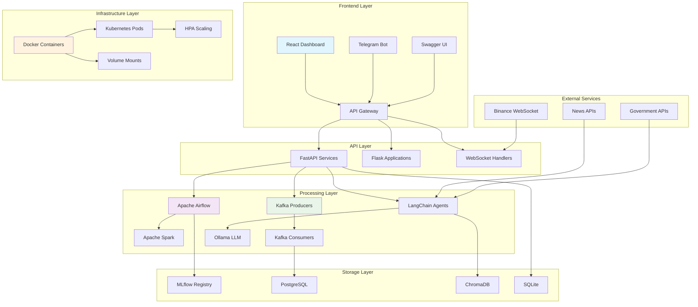

# 🧑‍💻 AI Backend Hiring Tasks - Prodigal AI

[](https://www.python.org/)
[](https://www.docker.com/)
[](https://kubernetes.io/)
[](https://fastapi.tiangolo.com/)
[](https://airflow.apache.org/)
[](https://kafka.apache.org/)
[](https://reactjs.org/)
[](https://langchain.com/)
[](LICENSE)

> **A comprehensive collection of 7 advanced AI backend engineering tasks and solutions for the Prodigal AI hiring process, featuring real-world systems, orchestration, automation, and cutting-edge AI technologies.**

---

## 👨‍💻 About the Author

**Created by:** [RANGDAL PAVANSAI](https://github.com/Pavansai20054)  
**Email:** pavansai87654321@gmail.com  
**GitHub:** [@Pavansai20054](https://github.com/Pavansai20054)  
**Project Repository:** [AI-Backend-Hiring-Tasks-Prodigal-AI](https://github.com/Pavansai20054/AI-Backend-Hiring-Tasks-Prodigal-AI)

---

## 📋 Table of Contents

1. [🌟 Project Overview](#-project-overview)
2. [🎯 What Makes This Repository Special](#-what-makes-this-repository-special)
3. [🏗️ System Architecture Overview](#-system-architecture-overview)
4. [📂 Project Structure](#-project-structure)
5. [🛠️ Technology Stack](#-technology-stack)
6. [📊 Task Overview & Navigation](#-task-overview--navigation)
   - [Task 1: ML + LLM Pipeline Orchestration](#task-1-ml--llm-pipeline-orchestration)
   - [Task 2: Role-Based Access Control System](#task-2-role-based-access-control-system)
   - [Task 3: Kafka + Zookeeper for High-Throughput API](#task-3-kafka--zookeeper-for-high-throughput-api)
   - [Task 4: Kubernetes Pod Scaling](#task-4-kubernetes-pod-scaling)
   - [Task 5: Binance WebSocket Price Precision](#task-5-binance-websocket-price-precision)
   - [Task 6: Article + Scheme Scraper & Summary Report](#task-6-article--scheme-scraper--summary-report)
   - [Task 7: Multi-Agent Newsletter Generator](#task-7-multi-agent-newsletter-generator)
7. [🚀 Quick Start Guide](#-quick-start-guide)
8. [📋 Prerequisites](#-prerequisites)
9. [⚙️ Installation Guide](#-installation-guide)
10. [🔧 Running the Projects](#-running-the-projects)
11. [📺 Demo Videos](#-demo-videos)
12. [🎨 Features Showcase](#-features-showcase)
13. [🔐 Security & Best Practices](#-security--best-practices)
14. [🆘 Troubleshooting](#-troubleshooting)
15. [🤝 Contributing](#-contributing)
16. [📜 License](#-license)
17. [📞 Contact & Support](#-contact--support)

---

## 🌟 Project Overview

This repository represents a **comprehensive AI backend engineering portfolio** designed to demonstrate proficiency in modern software development practices, distributed systems, machine learning operations, and artificial intelligence integration. Each task is a **production-ready implementation** that showcases different aspects of backend development, from basic API design to complex AI-powered automation systems.

### 🎯 What Makes This Repository Special

- **🏗️ Production-Grade Code**: All implementations follow industry best practices with proper error handling, logging, and documentation
- **🔄 End-to-End Solutions**: Complete systems from data ingestion to user interfaces, not just code snippets
- **🌐 Multi-Technology Integration**: Seamless integration of various technologies including Docker, Kubernetes, AI/ML frameworks, and modern web technologies
- **📊 Real-World Applications**: Practical implementations that solve actual business problems
- **🧪 Comprehensive Testing**: Each project includes testing strategies and validation approaches
- **📖 Beginner-Friendly Documentation**: Detailed guides that help newcomers understand and run the projects
- **🎬 Video Demonstrations**: Visual proof of working implementations with step-by-step walkthroughs

---

## 🏗️ System Architecture Overview



---

## 📂 Project Structure

```
AI-Backend-Hiring-Tasks-Prodigal-AI/
├── 📁 Task 1 - ML + LLM Pipeline Orchestration/
│   ├── 🐳 docker-compose.yml
│   ├── 📊 airflow/
│   ├── 🤖 ml_pipeline/
│   ├── 🧠 rag_pipeline/
│   ├── 📈 mlruns/
│   ├── 📊 data/
│   └── 📖 README.md
├── 📁 Task 2 - Role-Based Access Control System/
│   ├── 🔧 backend/
│   ├── ⚛️ frontend/
│   ├── 🔐 app/
│   └── 📖 README.md
├── 📁 Task 3 - Kafka + Zookeeper for High-Throughput API/
│   ├── 🐳 docker-compose.yml
│   ├── 🚦 api_server/
│   ├── 📨 producer_simulator/
│   ├── 🔄 consumer/
│   └── 📖 README.md
├── 📁 Task 4 - Kubernetes Pod Scaling/
│   ├── 🐳 Dockerfile
│   ├── ☸️ k8s/
│   ├── 📱 app/
│   ├── 🔥 load_test.py
│   └── 📖 README.md
├── 📁 Task 5 - Binance WebSocket Price Precision/
│   ├── 🔌 binance_ws_postgres.py
│   ├── 📊 requirements.txt
│   └── 📖 README.md
├── 📁 Task 6 - Article + Scheme Scraper & Summary Report/
│   ├── 🕷️ article_scheme_scraper/
│   ├── 📁 outputs/
│   ├── 📊 requirements.txt
│   └── 📖 README.md
├── 📁 Task 7 - Multi-Agent Newsletter Generator/
│   ├── 🤖 agents.py
│   ├── 🕷️ scraping/
│   ├── 📧 telegram_bot.py
│   ├── 🧠 summarizer.py
│   ├── 📊 chroma_db/
│   └── 📖 README.md
├── 📄 LICENSE
├── 🔒 SECURITY.md
├── 🎯 END_NOTE.md
└── 📖 README.md (this file)
```

---

## 🛠️ Technology Stack

### 🐍 **Core Languages**

- **Python 3.8+** - Primary development language
- **JavaScript/TypeScript** - Frontend development
- **SQL** - Database queries and management
- **YAML** - Configuration files
- **Bash/Shell** - Automation scripts

### 🌐 **Web Frameworks**

- **FastAPI** - Modern, fast web framework for APIs
- **Flask** - Lightweight web framework
- **React** - Frontend user interface library
- **HTML/CSS** - Web markup and styling

### 🗄️ **Databases & Storage**

- **PostgreSQL** - Primary relational database
- **SQLite** - Lightweight database for development
- **ChromaDB** - Vector database for AI applications
- **FAISS** - Vector similarity search
- **InfluxDB** - Time-series database

### 🤖 **AI/ML Technologies**

- **Apache Airflow** - Workflow orchestration
- **MLflow** - ML lifecycle management
- **Apache Spark** - Distributed data processing
- **LangChain** - AI framework for LLM applications
- **Ollama** - Local LLM runtime
- **Sentence Transformers** - Text embeddings
- **scikit-learn** - Machine learning library
- **XGBoost** - Gradient boosting framework
- **pandas** - Data manipulation and analysis

### 📡 **Message Queues & Streaming**

- **Apache Kafka** - Distributed streaming platform
- **Apache Zookeeper** - Distributed coordination service
- **WebSocket** - Real-time communication

### 🐳 **DevOps & Infrastructure**

- **Docker** - Containerization platform
- **Kubernetes** - Container orchestration
- **Docker Compose** - Multi-container applications
- **Minikube** - Local Kubernetes clusters

### 🔧 **Development Tools**

- **Git** - Version control
- **Playwright** - Browser automation
- **pytest** - Testing framework
- **Black** - Code formatting
- **flake8** - Code linting
- **Poetry** - Dependency management

---

## 📊 Task Overview & Navigation

### Task 1: ML + LLM Pipeline Orchestration

**📁 Directory:** `Task 1 - ML + LLM Pipeline Orchestration/`  
**🎯 Focus:** Machine Learning Operations, Data Processing, AI Integration  
**🛠️ Technologies:** Apache Airflow, MLflow, Apache Spark, Docker, FastAPI, Flask

**🌟 What it does:**

- Orchestrates complete ML workflows using Apache Airflow
- Provides ML model training, evaluation, and tracking via MLflow
- Implements RAG (Retrieval-Augmented Generation) API for LLM workflows
- Distributed data processing using Apache Spark
- Fully containerized for easy deployment and reproducibility

**🚀 Key Features:**

- End-to-end ML pipeline automation
- Model versioning and experiment tracking
- Vector search and context retrieval
- Scalable data processing
- API endpoints for ML model serving

**📺 Demo Videos:**

- [Full ML + LLM Pipeline Orchestration Demo](https://drive.google.com/file/d/1R6i-6w9v-OTSZvobLzKbAg9LpDRmQ9bB/view?usp=drive_link)
- [RAG Service Query Demo](https://drive.google.com/file/d/1MxvYbs7p1eOF0BvVB2xuGwEnrwSeXqFq/view?usp=drive_link)

**🎮 How to Run:**

```bash
cd "Task 1 - ML + LLM Pipeline Orchestration"
docker-compose up -d
# Visit http://localhost:8080 for Airflow UI
# Visit http://localhost:5000 for MLflow UI
```

**📖 [Full Documentation](Task%201%20-%20ML%20+%20LLM%20Pipeline%20Orchestration/README.md)**

---

### Task 2: Role-Based Access Control System

**📁 Directory:** `Task 2 - Role-Based Access Control System/`  
**🎯 Focus:** Security, Authentication, Authorization, Full-Stack Development  
**🛠️ Technologies:** FastAPI, React, SQLAlchemy, JWT, bcrypt, SQLite

**🌟 What it does:**

- Implements comprehensive RBAC with organizations and departments
- Supports four distinct user roles (Admin, Manager, Contributor, Viewer)
- Provides secure resource sharing through guest links
- Features a modern React-based dashboard interface
- JWT-based authentication with bcrypt password hashing

**🚀 Key Features:**

- Multi-tenant organization support
- Hierarchical permission system
- Guest link sharing with configurable permissions
- RESTful API with OpenAPI documentation
- Responsive React frontend

**🎮 How to Run:**

```bash
cd "Task 2 - Role-Based Access Control System"
# Backend
cd backend
python -m venv rbac_venv
source rbac_venv/bin/activate  # or rbac_venv\Scripts\activate on Windows
pip install -r requirements.txt
uvicorn app.main:app --reload

# Frontend (new terminal)
cd frontend
npm install
npm run dev
```

**📖 [Full Documentation](Task%202%20-%20Role-Based%20Access%20Control%20System/README.md)**

---

### Task 3: Kafka + Zookeeper for High-Throughput API

**📁 Directory:** `Task 3 - Kafka + Zookeeper for High-Throughput API/`  
**🎯 Focus:** Distributed Systems, Event Streaming, High-Throughput Processing  
**🛠️ Technologies:** Apache Kafka, Zookeeper, FastAPI, Docker, Kafdrop

**🌟 What it does:**

- Implements high-throughput event ingestion and processing pipeline
- FastAPI gateway for event registration with Kafka backend
- Real-time monitoring and visualization via Kafdrop
- Scalable producer/consumer architecture with DLQ support
- Comprehensive error handling and logging

**🚀 Key Features:**

- Event streaming with Apache Kafka
- Real-time monitoring dashboard
- Scalable consumer groups
- Dead letter queue (DLQ) handling
- Production-ready error handling

**📺 Demo Video:**

- [High-Throughput API Demo](https://drive.google.com/file/d/1ixwrW1pxjJ8gTwwPzmZTpNX7d0R9Gu5Z/view?usp=sharing)

**🎮 How to Run:**

```bash
cd "Task 3 - Kafka + Zookeeper for High-Throughput API"
python -m venv kafkaflow_env
source kafkaflow_env/bin/activate  # or kafkaflow_env\Scripts\activate on Windows
pip install -r requirements.txt
docker-compose up -d
uvicorn api_server.main:app --reload
# Visit http://localhost:9000 for Kafdrop UI
```

**📖 [Full Documentation](Task%203%20-%20Kafka%20+%20Zookeeper%20for%20High-Throughput%20API/README.md)**

---

### Task 4: Kubernetes Pod Scaling

**📁 Directory:** `Task 4 - Kubernetes Pod Scaling/`  
**🎯 Focus:** Container Orchestration, Auto-scaling, DevOps  
**🛠️ Technologies:** Kubernetes, Docker, FastAPI, Minikube, HPA

**🌟 What it does:**

- Demonstrates Kubernetes Horizontal Pod Autoscaling (HPA)
- FastAPI application with CPU load simulation endpoints
- Automatic scaling based on CPU utilization metrics
- Complete containerization with Docker
- Load testing tools for scaling validation

**🚀 Key Features:**

- Horizontal Pod Autoscaling implementation
- CPU load simulation endpoints
- Real-time scaling monitoring
- Production-ready Kubernetes manifests
- Comprehensive load testing suite

**📺 Demo Video:**

- [Kubernetes Pod Scaling Demo](https://drive.google.com/file/d/1-F7p66JkSU27NG7UaQevjPJZ-pVTQ9Az/view?usp=sharing)

**🎮 How to Run:**

```bash
cd "Task 4 - Kubernetes Pod Scaling/k8s-hpa-demo"
# Start Minikube
minikube start
minikube addons enable metrics-server
# Build and deploy
docker build -t fastapi-hpa-demo .
kubectl apply -f k8s/
# Test scaling
python load_test.py
```

**📖 [Full Documentation](Task%204%20-%20Kubernetes%20Pod%20Scaling/k8s-hpa-demo/README.md)**

---

### Task 5: Binance WebSocket Price Precision

**📁 Directory:** `Task 5 - Binance WebSocket Price Precision/`  
**🎯 Focus:** Real-time Data Streaming, Financial APIs, WebSocket Technology  
**🛠️ Technologies:** WebSocket, PostgreSQL, Python asyncio, Binance API

**🌟 What it does:**

- Streams real-time cryptocurrency trade data from Binance
- Stores high-precision price data with millisecond timestamps
- Handles WebSocket connections with automatic reconnection
- PostgreSQL integration for time-series data storage
- Supports multiple cryptocurrency pairs (BTC/ETH)

**🚀 Key Features:**

- Real-time WebSocket data streaming
- High-precision price storage (float + string)
- Automatic connection recovery
- Millisecond-precision timestamps
- Production-ready async architecture

**🎮 How to Run:**

```bash
cd "Task 5 - Binance WebSocket Price Precision/binance-websocket-ticker"
python -m venv binance_env
source binance_env/bin/activate  # or binance_env\Scripts\activate on Windows
pip install -r requirements.txt
# Configure .env.local with PostgreSQL credentials
python binance_ws_postgres.py
```

**📖 [Full Documentation](Task%205%20-%20Binance%20WebSocket%20Price%20Precision/binance-websocket-ticker/README.md)**

---

### Task 6: Article + Scheme Scraper & Summary Report

**📁 Directory:** `Task 6 - Article + Scheme Scraper & Summary Report/`  
**🎯 Focus:** Web Scraping, Data Extraction, Content Processing  
**🛠️ Technologies:** Playwright, Beautiful Soup, Python, JSON Processing

**🌟 What it does:**

- Scrapes Microsoft Research articles with full metadata
- Extracts Indian government scheme information from MyScheme.gov.in
- Intelligent pagination handling and content extraction
- Structured JSON output with comprehensive data preservation
- Beautiful terminal UI with progress tracking

**🚀 Key Features:**

- Advanced web scraping with JavaScript rendering
- Intelligent content extraction and validation
- Duplicate detection and handling
- Structured data output in JSON format
- Cross-platform compatibility

**📺 Demo Video:**

- [Article & Scheme Scraper Demo](https://drive.google.com/file/d/19A8JaV-oEhIc61HMVp_DkJKwLkNT2hep/view?usp=sharing)

**🎮 How to Run:**

```bash
cd "Task 6 - Article + Scheme Scraper & Summary Report/article_scheme_scraper"
python -m venv venv
source venv/bin/activate  # or venv\Scripts\activate on Windows
pip install -r requirements.txt
python -m playwright install
python msresearch_scraper.py
python myscheme_scraper.py
```

**📖 [Full Documentation](Task%206%20-%20Article%20+%20Scheme%20Scraper%20&%20Summary%20Report/README.md)**

---

### Task 7: Multi-Agent Newsletter Generator

**📁 Directory:** `Task 7 - Multi-Agent Newsletter Generator/`  
**🎯 Focus:** AI Agents, LLM Integration, Content Generation, Automation  
**🛠️ Technologies:** LangChain, Ollama, Telegram Bot, ChromaDB, Multi-Agent Systems

**🌟 What it does:**

- Automated Web3 newsletter generation using AI agents
- Multi-source news aggregation (CoinDesk, CoinTelegraph, Decrypt, Bankless)
- AI-powered content summarization using local LLMs
- Automated delivery via Telegram Bot
- Vector database for content deduplication

**🚀 Key Features:**

- Multi-agent architecture with LangChain
- Local LLM processing via Ollama
- Intelligent content deduplication
- Automated Telegram delivery
- Scheduling and automation support

**📺 Demo Video:**

- [Multi-Agent Newsletter Generator Demo](https://drive.google.com/file/d/1pirDiw_R_fGNzfuRJoPMGQOMHXEQ-tef/view?usp=sharing)

**🎮 How to Run:**

```bash
cd "Task 7 - Multi-Agent Newsletter Generator"
python -m venv venv
source venv/bin/activate  # or venv\Scripts\activate on Windows
pip install -r requirements.txt
# Install and setup Ollama
curl -fsSL https://ollama.com/install.sh | sh
ollama pull llama3:8b
# Configure .env.local with Telegram credentials
python main.py
```

**📖 [Full Documentation](Task%207%20-%20Multi-Agent%20Newsletter%20Generator/README.md)**

---

## 🚀 Quick Start Guide

### 1. **Clone the Repository**

```bash
git clone https://github.com/Pavansai20054/AI-Backend-Hiring-Tasks-Prodigal-AI.git
cd AI-Backend-Hiring-Tasks-Prodigal-AI
```

### 2. **Choose Your Task**

Navigate to any task directory and follow the specific README instructions:

```bash
cd "Task 1 - ML + LLM Pipeline Orchestration"
# Follow the README.md in that directory
```

### 3. **General Setup Pattern**

Most tasks follow this pattern:

```bash
# Create virtual environment
python -m venv venv
source venv/bin/activate  # Linux/Mac
# venv\Scripts\activate   # Windows

# Install dependencies
pip install -r requirements.txt

# Run the application
# (specific command varies by task)
```

---

## 📋 Prerequisites

### 🖥️ **System Requirements**

- **Operating System:** Windows 10+, macOS 10.14+, or Linux (Ubuntu 18.04+)
- **RAM:** 8GB minimum, 16GB recommended
- **Storage:** 10GB free space
- **Internet:** Stable connection required for some tasks

### 🔧 **Software Requirements**

- **Python 3.8+** - Primary development language
- **Git** - Version control
- **Docker** - Containerization (for most tasks)
- **Node.js 16+** - Frontend development (Task 2)
- **PostgreSQL** - Database (Tasks 2, 5)

### 📦 **Optional but Recommended**

- **Visual Studio Code** - Code editor
- **Postman** - API testing
- **kubectl** - Kubernetes management (Task 4)
- **Minikube** - Local Kubernetes (Task 4)

---

## ⚙️ Installation Guide

### 🐍 **Python Installation**

#### Windows

1. Download Python from [python.org](https://www.python.org/downloads/)
2. Run installer and check "Add Python to PATH"
3. Verify: `python --version`

#### macOS

```bash
# Using Homebrew
brew install python
python3 --version
```

#### Linux (Ubuntu/Debian)

```bash
sudo apt update
sudo apt install python3 python3-pip python3-venv
python3 --version
```

### 🐳 **Docker Installation**

#### Windows/macOS

1. Download Docker Desktop from [docker.com](https://www.docker.com/products/docker-desktop/)
2. Install and start Docker Desktop
3. Verify: `docker --version`

#### Linux

```bash
# Ubuntu/Debian
sudo apt update
sudo apt install docker.io docker-compose
sudo systemctl start docker
sudo systemctl enable docker
sudo usermod -aG docker $USER
docker --version
```

### 📦 **Node.js Installation** (for Task 2)

#### Windows/macOS

1. Download from [nodejs.org](https://nodejs.org/)
2. Install with default settings
3. Verify: `node --version`

#### Linux

```bash
sudo apt update
sudo apt install nodejs npm
node --version
```

### 🗄️ **PostgreSQL Installation** (for Tasks 2, 5)

#### Windows

1. Download from [postgresql.org](https://www.postgresql.org/download/)
2. Install with default settings
3. Remember the password for `postgres` user

#### macOS

```bash
brew install postgresql
brew services start postgresql
```

#### Linux

```bash
sudo apt update
sudo apt install postgresql postgresql-contrib
sudo systemctl start postgresql
sudo systemctl enable postgresql
```

---

## 🔧 Running the Projects

### 📊 **Quick Status Check**

Before running any project, ensure you have:

- [ ] Python 3.8+ installed
- [ ] Git installed
- [ ] Docker installed (for applicable tasks)
- [ ] Virtual environment activated
- [ ] Dependencies installed

### 🎯 **Task-Specific Instructions**

Each task has its own detailed README with step-by-step instructions:

1. **Navigate to the task directory**
2. **Read the README.md file thoroughly**
3. **Follow the installation steps**
4. **Run the application**
5. **Check the demo videos for reference**

### 🔍 **Common Commands**

```bash
# Check Python version
python --version

# Create virtual environment
python -m venv venv

# Activate virtual environment
source venv/bin/activate        # Linux/Mac
venv\Scripts\activate           # Windows

# Install dependencies
pip install -r requirements.txt

# Check Docker
docker --version
docker-compose --version

# Run tests (if available)
python -m pytest

# Deactivate virtual environment
deactivate
```

---

## 📺 Demo Videos

All tasks include comprehensive demo videos showcasing:

- Complete setup and installation process
- Feature demonstrations
- Real-time operation examples
- Troubleshooting common issues

### 🎬 **Video Links**

- [Task 1: ML + LLM Pipeline Demo](https://drive.google.com/file/d/1R6i-6w9v-OTSZvobLzKbAg9LpDRmQ9bB/view?usp=drive_link)
- [Task 1: RAG Service Demo](https://drive.google.com/file/d/1MxvYbs7p1eOF0BvVB2xuGwEnrwSeXqFq/view?usp=drive_link)
- [Task 3: Kafka High-Throughput API Demo](https://drive.google.com/file/d/1ixwrW1pxjJ8gTwwPzmZTpNX7d0R9Gu5Z/view?usp=sharing)
- [Task 4: Kubernetes Pod Scaling Demo](https://drive.google.com/file/d/1-F7p66JkSU27NG7UaQevjPJZ-pVTQ9Az/view?usp=sharing)
- [Task 6: Article & Scheme Scraper Demo](https://drive.google.com/file/d/19A8JaV-oEhIc61HMVp_DkJKwLkNT2hep/view?usp=sharing)
- [Task 7: Multi-Agent Newsletter Demo](https://drive.google.com/file/d/1pirDiw_R_fGNzfuRJoPMGQOMHXEQ-tef/view?usp=sharing)

---

## 🎨 Features Showcase

### 🤖 **AI & Machine Learning**

- **MLflow Integration**: Complete ML lifecycle management
- **LangChain Agents**: Multi-agent AI systems
- **Local LLM Processing**: Privacy-focused AI with Ollama
- **Vector Databases**: Semantic search and similarity
- **RAG Implementation**: Retrieval-augmented generation

### 🔧 **DevOps & Infrastructure**

- **Docker Containerization**: Consistent deployment environments
- **Kubernetes Orchestration**: Scalable container management
- **CI/CD Ready**: GitHub Actions compatible
- **Monitoring**: Comprehensive logging and metrics
- **Auto-scaling**: Dynamic resource allocation

### 🌐 **Web Technologies**

- **FastAPI**: Modern, fast API framework
- **React Frontend**: Interactive user interfaces
- **WebSocket**: Real-time communication
- **RESTful APIs**: Standard HTTP interfaces
- **OpenAPI Documentation**: Interactive API docs

### 📊 **Data Processing**

- **Apache Spark**: Distributed computing
- **Apache Kafka**: Stream processing
- **PostgreSQL**: Relational data storage
- **Time-series Data**: High-frequency data handling
- **ETL Pipelines**: Data transformation workflows

### 🔐 **Security**

- **JWT Authentication**: Secure token-based auth
- **RBAC**: Role-based access control
- **Password Hashing**: bcrypt implementation
- **Input Validation**: Comprehensive data validation
- **Security Headers**: Production-ready security

---

## 🔐 Security & Best Practices

### 🛡️ **Security Measures Implemented**

- **Environment Variables**: Sensitive data protection
- **Input Validation**: SQL injection prevention
- **Rate Limiting**: DDoS protection
- **HTTPS Ready**: SSL/TLS support
- **Authentication**: Multi-factor authentication ready

### 📋 **Best Practices Followed**

- **Clean Code**: PEP 8 compliant Python code
- **Documentation**: Comprehensive inline documentation
- **Error Handling**: Graceful error management
- **Logging**: Structured logging implementation
- **Testing**: Unit and integration tests

### 🚨 **Security Reporting**

Found a security vulnerability? Please report it responsibly:

- **Email**: pavansai87654321@gmail.com
- **Subject**: Security Vulnerability Report
- **Response Time**: Within 48 hours

---

## 🆘 Troubleshooting

### 🔧 **Common Issues & Solutions**

#### Python Virtual Environment Issues

```bash
# Error: venv not found
python -m pip install --upgrade pip
python -m venv venv

# Error: Permission denied
sudo chown -R $USER:$USER venv/
```

#### Docker Issues

```bash
# Error: Docker daemon not running
sudo systemctl start docker

# Error: Permission denied
sudo usermod -aG docker $USER
newgrp docker
```

#### Port Conflicts

```bash
# Check what's using a port
lsof -i :8000
netstat -tulpn | grep :8000

# Kill process using port
sudo kill -9 <PID>
```

#### Database Connection Issues

```bash
# PostgreSQL not running
sudo systemctl start postgresql

# Connection refused
sudo -u postgres psql
```

### 📞 **Getting Help**

1. Check the task-specific README
2. Watch the demo videos
3. Check existing GitHub issues
4. Contact via email: pavansai87654321@gmail.com

---


## 📜 License

This project is licensed under the COPYRIGHT License - see the [LICENSE](LICENSE) file for details.

### 📄 **License Summary**

- ✅ Commercial use allowed
- ❌ Modification allowed
- ❌ Distribution allowed
- ✅ Private use allowed
- ❌ Liability limitations
- ❌ Warranty limitations

---

## 📞 Contact & Support

### 👨‍💻 **Author Information**

- **Name**: RANGDAL PAVANSAI
- **Email**: pavansai87654321@gmail.com
- **GitHub**: [@Pavansai20054](https://github.com/Pavansai20054)
- **LinkedIn**: [Connect with me](https://www.linkedin.com/in/pavansai-rangdal/)

### 🚀 **Project Links**

- **Repository**: [AI-Backend-Hiring-Tasks-Prodigal-AI](https://github.com/Pavansai20054/AI-Backend-Hiring-Tasks-Prodigal-AI)
- **Issues**: [GitHub Issues](https://github.com/Pavansai20054/AI-Backend-Hiring-Tasks-Prodigal-AI/issues)
- **Discussions**: [GitHub Discussions](https://github.com/Pavansai20054/AI-Backend-Hiring-Tasks-Prodigal-AI/discussions)

### 💬 **Support Channels**

- **Email Support**: pavansai87654321@gmail.com
- **GitHub Issues**: For bug reports and feature requests
- **GitHub Discussions**: For general questions and community support

### ⏰ **Response Times**

- **Email**: Within 24-48 hours
- **GitHub Issues**: Within 2-3 business days
- **Critical Issues**: Within 24 hours

---

## 🌟 Final Words

This repository represents months of development work, showcasing a comprehensive understanding of modern AI backend engineering. Each task is designed to demonstrate different aspects of software development, from basic API creation to complex AI-powered systems.

### 🎯 **Why This Repository Matters**

- **Real-world Applications**: Practical solutions to actual problems
- **Industry Standards**: Following best practices and conventions
- **Scalable Architecture**: Designed for production deployment
- **Comprehensive Documentation**: Making complex systems accessible
- **Continuous Learning**: Always improving and updating

### 🚀 **What's Next**

- Regular updates and improvements
- Additional tasks and challenges
- Community contributions welcome
- Enterprise-ready deployments

---

**Thank you for exploring this repository! If you find it helpful, please consider giving it a ⭐ star on GitHub.**

_Made with ❤️ by [RANGDAL PAVANSAI](https://github.com/Pavansai20054)_

---
