# ML + LLM Pipeline Orchestration 🦾🤖

[](https://www.python.org/)
[](https://www.docker.com/)
[](https://airflow.apache.org/)
[](https://mlflow.org/)
[](https://spark.apache.org/)
[](https://fastapi.tiangolo.com/)
[](https://flask.palletsprojects.com/)
[](https://www.sbert.net/)
[](https://pandas.pydata.org/)
[](https://scikit-learn.org/)
[](https://xgboost.readthedocs.io/)
[](https://github.com/facebookresearch/faiss)
[](https://github.com/jsvine/pdfplumber)

---

## 📖 Table of Contents

- [📌 Introduction](#-introduction)
- [🗺️ Architecture Overview](#-architecture-overview)
- [🎯 Mermaid Diagram](#-mermaid-diagram)
- [🛠️ Technology Stack](#-technology-stack)
- [🚀 Setup and Installation](#-setup-and-installation)
  - [1️⃣ Prerequisites](#1-prerequisites)
  - [2️⃣ Python Installation](#2-python-installation)
  - [3️⃣ Docker Installation](#3-docker-installation)
  - [4️⃣ Docker Compose Installation (If Required)](#4-docker-compose-installation-if-required)
  - [5️⃣ Clone the Repository](#5-clone-the-repository)
  - [6️⃣ Project Structure](#6-project-structure)
  - [7️⃣ Python Virtual Environment (Optional)](#7-python-virtual-environment-optional)
  - [8️⃣ Environment Variables and Configuration](#8-environment-variables-and-configuration)
- [⚒️ How to Build and Run the Project](#️-how-to-build-and-run-the-project)
- [🌐 Service Endpoints](#-service-endpoints)
- [🛠️ Airflow Troubleshooting](#️-airflow-troubleshooting)
- [💡 MLflow Troubleshooting](#-mlflow-troubleshooting)
- [🔗 Pipeline DAG (Mermaid Diagram)](#-pipeline-dag-mermaid-diagram)
- [🔍 How Each Service Works](#-how-each-service-works)
- [🐞 Common Issues and Solutions](#-common-issues-and-solutions)
- [🚦 Advanced Usage](#-advanced-usage)
- [⚖️ License](#-license)
- [👤 Contact](#-contact)

---

## 📌 Introduction

> **ML + LLM Pipeline Orchestration** is a robust, scalable, and modular system for orchestrating end-to-end machine learning (ML) and retrieval-augmented generation (RAG) workflows. It leverages containerization, modern orchestration, and state-of-the-art ML/RAG techniques for production-ready deployment and reproducibility.

**Key Features:**
- 🔁 Orchestrates the ML workflows using Apache Airflow (ETL, training, evaluation, and tracking)
- ⚡ ML model training, evaluation, tracking, and API serving
- 🤖 RAG API for LLM workflows with vector search and context retrieval
- 📊 Experiment tracking via MLflow
- 🖥️ Distributed data processing using Apache Spark
- 🐳 Fully containerized for easy deployment and reproducibility

---

## 🗺️ Architecture Overview

<!--
All major services are decoupled and run in their own containers.
Data flows via shared volumes and REST APIs.
Airflow orchestrates the ML pipeline steps.
RAG and ML services are API endpoints for LLM and ML workflows.
-->

- **Airflow** triggers all pipeline steps and schedules periodic tasks.
- **ML pipeline** handles preprocessing, feature engineering, training, and evaluation.
- **MLflow** logs metrics and models for experiment tracking.
- **ML Service** provides APIs for serving ML models.
- **RAG Service** exposes APIs for LLMs and context retrieval.
- **Spark** enables distributed computation for data preprocessing.
- **Shared data** is managed by Docker volumes and accessible by all containers.

---

## 🎯 Mermaid Diagram

```mermaid
flowchart TD
    subgraph Data_Processing
        Spark["⚡ Spark Master"]
        Preprocess["🧹 Preprocess.py"]
        FeatureEng["🛠️ Feature Engineering.py"]
    end

    subgraph ML_Training
        Train["🏋️ Train.py"]
        Evaluate["🧪 Evaluate.py"]
        MLflow["📊 MLflow Tracking"]
    end

    subgraph Services
        MLService["🧠 ML Service (Flask)"]
        RAGService["🤖 RAG Service (FastAPI)"]
    end

    Data["🗂️ Data"]
    Airflow -->|Triggers| Preprocess
    Preprocess --> FeatureEng
    FeatureEng --> Train
    Train --> Evaluate
    Train --> MLflow
    Evaluate --> MLflow
    MLService <-->|API| MLflow
    RAGService <-->|API| MLService
    Spark <--> Preprocess
    Spark <--> FeatureEng
    Data -.->|Shared| Preprocess
    Data -.->|Shared| FeatureEng
    Data -.->|Shared| Train
    Data -.->|Shared| Evaluate
    Data -.->|Shared| RAGService
```


---

## 🛠️ Technology Stack

- **🐍 Python 3.10** — All custom scripts/services
- **🐳 Docker** — Containerization of all services
- **🍱 Docker Compose** — Multi-container orchestration
- **🌀 Apache Airflow** — Workflow orchestration and scheduling
- **📈 MLflow** — ML experiment tracking/model registry
- **⚡ Apache Spark** — Distributed preprocessing
- **⚡ FastAPI** — Modern, fast web framework for RAG Service
- **🧠 Flask** — Lightweight web framework for ML Service
- **🔤 Sentence Transformers** — Text embedding for RAG
- **🗃️ FAISS** — Fast vector similarity search/indexing
- **📊 pandas, scikit-learn, XGBoost** — ML stack
- **📄 pdfplumber** — PDF ingestion

---

## 🚀 Setup and Installation

### 1️⃣ Prerequisites

You need the following on your system:

- **Git**: For cloning the repository  
- **Python 3.10+**: For local scripts and Docker images  
- **Docker (20.10+)**: For containerization  
- **Docker Compose**: Included in most Docker Desktop installations  

---

### 2️⃣ Python Installation

> **You only need Python installed on your host if you want to run scripts or tests locally (not inside Docker).**

#### 🪟 Windows

1. Download Python from [python.org](https://www.python.org/downloads/).
2. Run the installer and **check "Add Python to PATH"**.
3. Verify installation:
   ```sh
   python --version
   ```

#### 🍏 macOS

1. Install Homebrew (if not installed):
   ```sh
   /bin/bash -c "$(curl -fsSL https://raw.githubusercontent.com/Homebrew/install/HEAD/install.sh)"
   ```
2. Install Python:
   ```sh
   brew install python@3.10
   python3 --version
   ```

#### 🐧 Linux (Ubuntu/Debian)

```sh
sudo apt-get update
sudo apt-get install python3.10 python3.10-venv python3.10-dev -y
python3.10 --version
```

---

### 3️⃣ Docker Installation

**🪟 Windows:**  
- Download Docker Desktop: [Docker Desktop for Windows](https://www.docker.com/products/docker-desktop)
- Follow installer prompts, start Docker Desktop, and verify:
  ```sh
  docker --version
  ```

**🍏 macOS:**  
- Download Docker Desktop: [Docker Desktop for Mac](https://www.docker.com/products/docker-desktop)
- Drag Docker to Applications, start Docker Desktop, and verify:
  ```sh
  docker --version
  ```

**🐧 Linux (Ubuntu/Debian):**
```sh
sudo apt-get update
sudo apt-get install \
    ca-certificates \
    curl \
    gnupg
sudo mkdir -p /etc/apt/keyrings
curl -fsSL https://download.docker.com/linux/ubuntu/gpg | \
    sudo gpg --dearmor -o /etc/apt/keyrings/docker.gpg
echo \
  "deb [arch="$(dpkg --print-architecture)" \
  signed-by=/etc/apt/keyrings/docker.gpg] \
  https://download.docker.com/linux/ubuntu \
  $(lsb_release -cs) stable" | \
  sudo tee /etc/apt/sources.list.d/docker.list > /dev/null
sudo apt-get update
sudo apt-get install docker-ce docker-ce-cli containerd.io docker-buildx-plugin docker-compose-plugin
sudo usermod -aG docker $USER
docker --version
```

---

### 4️⃣ Docker Compose Installation (If Required)

**Most Docker Desktop installations include Compose.**

**🐧 Linux:**  
```sh
sudo curl -L "https://github.com/docker/compose/releases/download/v2.24.7/docker-compose-$(uname -s)-$(uname -m)" -o /usr/local/bin/docker-compose
sudo chmod +x /usr/local/bin/docker-compose
docker-compose --version
```

---

### 5️⃣ Clone the Repository

```sh
git clone https://github.com/<your-username>/<your-repo>.git
cd <your-repo>
```

---

## 6️⃣ Project Structure 🗂️✨

> **💡 Each directory/service has a clear responsibility.**

```
.
├── airflow/                             # 🌀 Airflow orchestration
│   └── dags/                            # 📅 DAGs for ML pipelines
│       ├── ml_pipeline_titanic_dag.py       # 🚢 Titanic pipeline DAG
│       └── ml_pipeline_winequality_dag.py   # 🍷 Wine Quality pipeline DAG
├── data/                                # 📊 Datasets
│   ├── titanic.csv                          # 🚢 Titanic dataset
│   └── winequality-red.csv                  # 🍷 Wine Quality dataset
├── mlruns/                              # 🗃️ MLflow experiment storage (auto-generated)
├── ml_pipeline/                         # 🏗️ ML scripts
│   ├── serve.py                             # 🌐 Serve ML model API
│   ├── titanic_evaluate.py                  # 🧪 Titanic evaluation
│   ├── titanic_feature_engineering.py       # 🛠️ Titanic feature engineering
│   ├── titanic_preprocess.py                # 🧹 Titanic data preprocessing
│   ├── titanic_train.py                     # 🏋️ Titanic model training
│   ├── wine_evaluate.py                     # 🧪 Wine evaluation
│   ├── wine_feature_engineering.py          # 🛠️ Wine feature engineering
│   ├── wine_preprocess.py                   # 🧹 Wine data preprocessing
│   └── wine_train.py                        # 🏋️ Wine model training
├── rag_pipeline/                        # 🧠 RAG (Retrieval-Augmented Generation) scripts
│   ├── embed.py                             # 🔤 Embedding utility
│   ├── ingest.py                            # 📥 Ingest data for RAG
│   ├── rag_api.py                           # 🤖 RAG API service
│   └── vector_store.py                      # 🗄️ Vector store (FAISS)
├── docker-compose.yml                   # 🐳 Docker Compose config
├── Dockerfile.airflow                   # 🌀 Airflow Dockerfile
├── Dockerfile.ml                        # 🏗️ ML Service Dockerfile
├── Dockerfile.rag                       # 🤖 RAG Service Dockerfile
├── Makefile                             # 🛠️ Makefile for easy commands
├── README.md                            # 📖 This documentation
├── requirements.txt                     # 📦 Python dependencies
└── todo.md                              # ✅ Project TODOs
```

---

### 7️⃣ Python Virtual Environment (Optional)

For running scripts locally (not required for Docker):

```sh
python3.10 -m venv prodigal_env
source prodigal_env/bin/activate  # (Linux/macOS)
prodigal_env\Scripts\activate     # (Windows)
pip install -r requirements.txt
```

---

### 8️⃣ Environment Variables and Configuration

- All main configs are in `docker-compose.yml`.
- Volumes are used to persist data across runs.
- To customize DB URIs, edit environment in Compose file.

---

## ⚒️ How to Build and Run the Project 🚦

> **Each step is important! Follow in order for smooth setup.**

---

### 0️⃣ (Optional, but Recommended) Start with a Clean Slate 🧹

If you want to **wipe all Docker images, containers, and volumes, and clean your MLflow experiments**, follow these steps:

#### 🪟 Windows (PowerShell):

```powershell
# Remove old mlruns directory (MLflow experiment data)
Remove-Item -Recurse -Force .\mlruns

# Re-create a clean mlruns directory (ensures Docker can write)
New-Item -ItemType Directory -Path .\mlruns

# Grant full permissions to mlruns directory (avoids Docker permission errors)
icacls .\mlruns /grant "Everyone:(F)" /T

# Stop and remove all running containers, networks, and named volumes from compose
docker compose down -v

# Remove all Docker images, containers, volumes, and build cache
docker system prune -a -f --volumes
```

#### 🐧 Linux/macOS (Terminal):

```sh
rm -rf ./mlruns                 # Remove previous MLflow experiment data
mkdir ./mlruns                  # Re-create mlruns directory
chmod -R 777 ./mlruns           # Ensure Docker has permissions
docker compose down -v          # Stop and remove containers, volumes
docker system prune -a -f --volumes  # Remove all images/volumes
```

> 💡 **Use these commands only when you want to fully reset your environment! This will remove all containers, images, and saved model/data volumes.**

---

### 1️⃣ Build Docker Images 🏗️

```sh
docker-compose build
```
or with Makefile:
```sh
make build
```

---

### 2️⃣ Initialize Airflow Database 🚦

> **Do this ONLY once, after first build or after deleting volumes.**

```sh
docker-compose run airflow airflow db init
```
or:
```sh
make airflow-init
```

---

### 3️⃣ Start All Services 🚀

```sh
docker-compose up
```
or:
```sh
make up
```

To run in the background:
```sh
docker-compose up -d
```

---

### 4️⃣ Stopping All Services 🛑

```sh
docker-compose down
```
or:
```sh
make down
```

---

### 5️⃣ Clean Up All Volumes & Images 🧹

```sh
docker-compose down -v --rmi all
```
or, to also prune dangling images/volumes:
```sh
docker system prune -a -f --volumes
```

---

## 🌐 Service Endpoints 🌎

| Service         | URL                                    | Description                          |
|-----------------|----------------------------------------|--------------------------------------|
| 🌀 Airflow         | http://localhost:8081                  | Airflow UI (admin/admin)             |
| 📈 MLflow         | http://localhost:5000                  | MLflow Tracking UI                   |
| 🧠 ML Service     | http://localhost:5001                  | Flask ML API root                    |
| 🤖 RAG Service    | http://localhost:8000                  | FastAPI RAG root (404 normal)        |
| 📓 RAG Swagger UI | http://localhost:8000/docs             | FastAPI docs                         |
| ⚡ Spark Master UI| http://localhost:8080                  | Spark Web UI                         |

---

## 🛠️ Airflow Troubleshooting 🌀

### 💥 Airflow Database Not Initialized

**Symptom:**  
```
ERROR: You need to initialize the database. Please run `airflow db init`.
```

**Solution:**
1. Stop all containers:
   ```sh
   docker-compose down -v
   ```
2. Make sure your `docker-compose.yml` includes:
   ```yaml
   airflow:
     ...
     volumes:
       ...
       - airflow_db:/tmp
   volumes:
     mlruns:
     airflow_db:
   ```
3. Re-initialize:
   ```sh
   docker-compose run airflow airflow db init
   ```
4. Start services:
   ```sh
   docker-compose up
   ```

### 🛑 Other Common Issues

- **Port Conflicts:** Change the port in `docker-compose.yml` or stop the conflicting service.
- **Permission Errors:**  
  ```sh
  chmod -R 777 ./mlruns ./data ./airflow
  ```
- **Services Not Running:** Check logs  
  ```sh
  docker-compose logs <service>
  ```
- **DAG Not Shown:** Check DAG folder mapping and DAG file for syntax errors.

---

## 💡 MLflow Troubleshooting 📈

### 🧐 MLflow Experiments or Runs Not Showing Up

- **Check Tracking URI:**  
  Ensure your scripts use  
  ```python
  mlflow.set_tracking_uri("http://mlflow:5000")
  ```
  and not a local `file://` URI when running in Docker Compose.

- **Run Scripts Inside the Container:**  
  ```sh
  docker compose exec ml_service python titanic_train.py
  ```
  Not on your host!

- **Check Volumes:**  
  Make sure `./mlruns` is mounted and permissions are correct.  
  On Windows, run (in PowerShell):
  ```powershell
  icacls .\mlruns /grant "Everyone:(F)" /T
  ```
  On Linux/macOS:
  ```sh
  chmod -R 777 ./mlruns
  ```

- **Verify Artifacts:**  
  After running a script, you should see new folders inside `mlruns/` and see new runs in the MLflow UI at [http://localhost:5000](http://localhost:5000).

- **Reset MLflow State:**  
  If you want to start from scratch:
  ```powershell
  Remove-Item -Recurse -Force .\mlruns
  New-Item -ItemType Directory -Path .\mlruns
  icacls .\mlruns /grant "Everyone:(F)" /T
  ```
  Or in bash:
  ```sh
  rm -rf ./mlruns
  mkdir ./mlruns
  chmod -R 777 ./mlruns
  ```

- **Check MLflow Service Logs:**  
  ```sh
  docker-compose logs mlflow
  ```

- **Clear Docker State:**  
  ```sh
  docker compose down -v
  docker system prune -a -f --volumes
  ```

- **Still not working?**  
  - Double-check all paths and volume mounts.
  - Look for errors in the logs.
  - Ensure you are not running out of disk space.

---

## 🔗 Pipeline DAG (Mermaid Diagram) 📊

```mermaid
graph TD;
    A[🧹 Preprocess Data] --> B[🛠️ Feature Engineering]
    B --> C[🏋️ Train Model]
    C --> D[🧪 Evaluate Model]
    C --> E[📦 Log Model to MLflow]
    D --> E
    E --> F[🧠 ML Service API]
    F --> G[🤖 RAG Service API]
    subgraph Orchestrator
      A
      B
      C
      D
    end
    subgraph Services
      F
      G
    end
```



---

## 🔍 How Each Service Works 🧩

### 🌀 Airflow

- Orchestrates the entire ML pipeline via DAGs.
- Triggers Python scripts for ETL, training, and evaluation.
- Handles scheduling and monitoring.

### 🧠 ML Service

- Flask API serving model predictions.
- Healthcheck endpoint at `/`.
- Communicates with MLflow for model artifacts.

### 🤖 RAG Service

- FastAPI backend for retrieval-augmented generation.
- Embeds, indexes, and serves context for LLM queries.
- `/docs` endpoint gives OpenAPI UI for testing.
- Uses Sentence Transformers and FAISS for vector search.

### 📈 MLflow

- Tracks experiment runs, metrics, models.
- UI at http://localhost:5000

### ⚡ Spark

- Used for distributed ETL/preprocessing in Airflow DAGs.
- UI at http://localhost:8080

---

## 🐞 Common Issues and Solutions 🛠️

### 1. "Endpoint not found" for ML/RAG Service

- **Cause:** Accessing `/` on RAG service (which only has `/docs`, `/rag_query`)
- **Solution:** Use `/docs` or POST to `/rag_query`.

### 2. "Database not initialized" (Airflow)

- **Cause:** Airflow DB not persisted via volume.
- **Solution:** See [Airflow Troubleshooting](#️-airflow-troubleshooting).

### 3. "Permission denied" on volumes

- **Cause:** Docker container cannot write to mapped host folders.
- **Solution:** Change directory permissions on host.

### 4. "Image not found" Errors

- **Cause:** Docker images not built.
- **Solution:**  
  ```sh
  docker-compose build
  ```

### 5. "Port already allocated"

- **Cause:** Port in use.
- **Solution:** Change port mapping in `docker-compose.yml` or stop the other service.

---

## 🚦 Advanced Usage ⚙️

### 🔹 Running Airflow CLI

```sh
docker-compose run airflow airflow dags list
docker-compose run airflow airflow tasks list ml_pipeline_dag
```

### 🔹 Customizing the Pipeline

- Add/modify scripts in `ml_pipeline` or `rag_pipeline`.
- Update Airflow DAGs in `airflow/dags`.

### 🔹 Logs

```sh
docker-compose logs airflow
docker-compose logs ml_service
docker-compose logs rag_service
docker-compose logs mlflow
```

### 🔹 Clean Up

```sh
docker-compose down -v --rmi all
```
or:
```sh
docker system prune -a -f --volumes
```

---

## ⚖️ License 📜

> 🛑 **This project is _not open source_. All rights reserved.**

See the [LICENSE](../../LICENSE) file for details.

---

## 👤 Contact 🙋

**Pavan Sai** 👨‍💻

📧 **Email**: [pavansai7654321@gmail.com](mailto:pavansai7654321@gmail.com)  
🐙 **GitHub**: [@Pavansai20054](https://github.com/Pavansai20054)  

---

# 📝 Appendix: Example Commands & API Requests

```sh
# Test RAG API
curl -X POST "http://localhost:8000/rag_query" \
     -H "Content-Type: application/json" \
     -d "{\"query\": \"What is the Eiffel Tower?\"}"

# Airflow DAG Trigger
# 1. Open http://localhost:8081
# 2. Login with admin/admin
# 3. Find and trigger ml_pipeline_dag

# Rebuild ML Service after code changes
docker-compose build ml_service
docker-compose up ml_service

# Access logs for debugging
docker-compose logs airflow
docker-compose logs ml_service
docker-compose logs rag_service
docker-compose logs mlflow
```

---

# ✨ FAQ

**Q: Can I use a different database for Airflow/MLflow?**  
A: Yes, update the database URI in `docker-compose.yml` and ensure the service can access the new DB.

**Q: I get "cannot connect" errors for a service.**  
A: Wait for all containers to start (Airflow and MLflow may take 1-2 min on first startup).

**Q: Can I change host ports?**  
A: Yes, edit the port mappings in `docker-compose.yml`.

**Q: How do I update dependencies?**  
A: Edit `requirements.txt` and rebuild affected services with `docker-compose build`.

---