# 🏢 Role-Based Access Control System (RBAC)

<div align="center">

[](https://www.python.org/downloads/)
[](https://fastapi.tiangolo.com/)
[](https://react.dev/)
[](https://docs.sqlalchemy.org/)
[](../LICENSE)


**A production-grade, full-stack Role-Based Access Control system with Organizations, Departments, Guest Links, and comprehensive permission management.**

</div>

---

## 📚 Table of Contents

- [🏢 Role-Based Access Control System (RBAC)](#-role-based-access-control-system-rbac)
  - [📚 Table of Contents](#-table-of-contents)
  - [🎯 Project Overview](#-project-overview)
    - [🌟 What Makes This Special?](#-what-makes-this-special)
  - [✨ Features](#-features)
    - [🔐 Authentication & Security](#-authentication--security)
    - [🏢 Organization Management](#-organization-management)
    - [👥 User Role System](#-user-role-system)
    - [📁 Resource Management](#-resource-management)
    - [🔗 Guest Link System](#-guest-link-system)
    - [🎨 User Interface](#-user-interface)
    - [📊 API & Documentation](#-api--documentation)
  - [🏗️ Architecture](#️-architecture)
    - [📊 System Diagram](#-system-diagram)
    - [📁 Project Structure](#-project-structure)
  - [🛠️ Technology Stack](#️-technology-stack)
    - [🔧 Backend Technologies](#-backend-technologies)
    - [🎨 Frontend Technologies](#-frontend-technologies)
  - [⚡ Quick Start](#-quick-start)
    - [📋 Prerequisites](#-prerequisites)
    - [🔧 Installation](#-installation)
  - [🚀 Backend Setup](#-backend-setup)
    - [💾 Database Initialization](#-database-initialization)
    - [🏃‍♂️ Running the API Server](#️-running-the-api-server)
  - [🎨 Frontend Setup](#-frontend-setup)
    - [📦 Installing Dependencies](#-installing-dependencies)
    - [🔥 Development Server](#-development-server)
  - [📑 API Documentation](#-api-documentation)
    - [🔐 Authentication Endpoints](#-authentication-endpoints)
    - [🏢 Organization Endpoints](#-organization-endpoints)
    - [🏭 Department Endpoints](#-department-endpoints)
    - [👥 User Management Endpoints](#-user-management-endpoints)
    - [📁 Resource Endpoints](#-resource-endpoints)
    - [🔗 Guest Link Endpoints](#-guest-link-endpoints)
  - [👩‍💻 User Flows](#-user-flows)
    - [🛠️ System Workflow](#️-system-workflow)
    - [🔑 Authentication Flow](#-authentication-flow)
    - [🏢 Organization Management](#-organization-management-1)
    - [📁 Resource Management](#-resource-management-1)
    - [🔗 Guest Link Sharing](#-guest-link-sharing)
  - [💡 Usage Examples](#-usage-examples)
    - [🔧 API Examples](#-api-examples)
      - [Creating a Resource with cURL](#creating-a-resource-with-curl)
      - [Response Example](#response-example)
      - [Creating a Guest Link](#creating-a-guest-link)
      - [Guest Link Response](#guest-link-response)
    - [🌐 Frontend Usage](#-frontend-usage)
      - [Getting Your JWT Token](#getting-your-jwt-token)
      - [Using the Dashboard](#using-the-dashboard)
      - [Guest Preview Feature](#guest-preview-feature)
  - [🛠️ Troubleshooting](#️-troubleshooting)
    - [🐛 Common Issues](#-common-issues)
      - [Frontend Issues](#frontend-issues)
      - [Backend Issues](#backend-issues)
      - [Authentication Issues](#authentication-issues)
    - [🔧 Solutions](#-solutions)
      - [Database Reset](#database-reset)
      - [Environment Variables](#environment-variables)
  - [🔒 Security Features](#-security-features)
    - [🛡️ Authentication Security](#️-authentication-security)
    - [🔐 Authorization Security](#-authorization-security)
    - [🚫 Security Best Practices](#-security-best-practices)
  - [📄 License](#-license)
  - [📞 Support & Contact](#-support--contact)
    - [🆘 Getting Help](#-getting-help)
    - [🏷️ Project Maintainer](#️-project-maintainer)
    - [🌟 Acknowledgments](#-acknowledgments)

---

## 🎯 Project Overview

This repository contains a **comprehensive, production-ready Role-Based Access Control (RBAC) system** designed for modern organizations. The system provides fine-grained access control with support for hierarchical organizations, departments, user roles, and secure resource sharing through guest links.

### 🌟 What Makes This Special?

- **🏢 Multi-tenant Architecture**: Support for multiple organizations with nested departments
- **👤 Role-based Permissions**: Four distinct roles (Admin, Manager, Contributor, Viewer) with granular permissions
- **📁 Resource Management**: Complete CRUD operations with owner-based access control
- **🔗 Guest Link Sharing**: Secure, token-based resource sharing with view/edit permissions
- **🔐 JWT Authentication**: Industry-standard security with bcrypt password hashing
- **📊 RESTful API**: Comprehensive API with OpenAPI/Swagger documentation
- **🎨 Modern Frontend**: React-based interface with responsive design

---

## ✨ Features

### 🔐 **Authentication & Security**
- JWT-based authentication with secure token management
- Password hashing with bcrypt
- Protected routes and middleware
- Session management

### 🏢 **Organization Management**
- Multi-tenant organization support
- Nested department structure
- Hierarchical permission inheritance
- Organization-level user management

### 👥 **User Role System**
- **Admin**: Full system access and management
- **Manager**: Department and resource management
- **Contributor**: Resource creation and editing
- **Viewer**: Read-only access to assigned resources

### 📁 **Resource Management**
- Create, read, update, delete operations
- Owner-based access control
- Department and organization-level sharing
- File upload and content management

### 🔗 **Guest Link System**
- Secure token-based sharing
- Configurable view/edit permissions
- Optional expiration dates
- Anonymous access without authentication

### 🎨 **User Interface**
- Responsive React frontend
- Intuitive dashboard interface
- Real-time updates
- Guest preview functionality

### 📊 **API & Documentation**
- RESTful API design
- OpenAPI/Swagger documentation
- Comprehensive endpoint coverage
- Interactive API testing

---

## 🏗️ Architecture

### 📊 System Diagram

```mermaid
graph TD
    A[👤 User] -->|Sign Up/In| B[🔐 Authentication]
    B -->|JWT Token| C[🏢 Organizations]
    C -->|Contains| D[🏭 Departments]
    D -->|Has| E[👥 Users with Roles]
    E -->|Access| F[📁 Resources]
    F -->|Can Share| G[🔗 Guest Links]
    G -->|Token Access| H[🌐 Guest Users]
    
    I[🎨 React Frontend] -->|API Calls| J[⚡ FastAPI Backend]
    J -->|ORM| K[💾 SQLite Database]
    J -->|Swagger| L[📑 API Documentation]
    
    style A fill:#e1f5fe
    style I fill:#f3e5f5
    style J fill:#e8f5e8
    style K fill:#fff3e0
```



### 📁 Project Structure

```
rbac-system/
├── backend/
│   ├── app/
│   │   ├── __init__.py
│   │   ├── main.py
│   │   ├── models.py
│   │   ├── schemas.py
│   │   ├── deps.py
│   │   ├── crud.py
│   │   ├── auth.py
│   │   ├── orgs.py
│   │   ├── depts.py
│   │   ├── users.py
│   │   ├── resources.py
│   │   ├── guests.py
│   │   ├── rbac_model.conf
│   │   └── rbac_policy.csv
│   ├── requirements.txt
│   └── README.md
└── frontend/
    ├── src/
    │   ├── main.jsx
    │   ├── App.jsx
    │   ├── pages/
    │   │   ├── SignIn.jsx
    │   │   ├── SignUp.jsx
    │   │   ├── Dashboard.jsx
    │   │   └── GuestPreview.jsx
    ├── package.json
    └── README.md
```

---

## 🛠️ Technology Stack

### 🔧 Backend Technologies

| Component | Technology | Version | Purpose |
|-----------|------------|---------|---------|
| **Framework** | FastAPI | 0.95+ | High-performance REST API framework |
| **Database** | SQLAlchemy + SQLite | 2.0+ | ORM and database management |
| **Authentication** | python-jose | Latest | JWT token handling |
| **Password Security** | passlib[bcrypt] | Latest | Secure password hashing |
| **Validation** | Pydantic | Latest | Request/response validation |
| **Documentation** | Swagger/OpenAPI | Built-in | Interactive API documentation |

### 🎨 Frontend Technologies

| Component | Technology | Version | Purpose |
|-----------|------------|---------|---------|
| **Framework** | React | 18+ | Modern UI library |
| **Build Tool** | Vite | Latest | Fast development and building |
| **HTTP Client** | Fetch API | Built-in | API communication |
| **Styling** | CSS3 | Latest | Responsive design |
| **State Management** | React Hooks | Built-in | Component state management |

---

## ⚡ Quick Start

### 📋 Prerequisites

Before you begin, ensure you have the following installed:

- **Python 3.10+** 🐍
- **Node.js 16+** 📦
- **npm or yarn** 📋
- **Git** 🔧

### 🔧 Installation

1. **Clone the repository**
   ```bash
   git clone https://github.com/Pavansai20054/AI-Backend-Hiring-Tasks-Prodigal-AI.git
   
   cd "AI-Backend-Hiring-Tasks-Prodigal-AI/Task 2 - Role-Based Access Control System"
   ```

2. **Set up the backend**

   #### a. **Create a virtual environment named `rbac_venv`**

   - **For Windows:**
     ```bash
     cd backend
     python -m venv rbac_venv
     rbac_venv\Scripts\activate
     ```

   - **For macOS/Linux:**
     ```bash
     cd backend
     python3 -m venv rbac_venv
     source rbac_venv/bin/activate
     ```

   #### b. **Install dependencies**
   ```bash
   pip install -r requirements.txt
   ```

---

## 🚀 Backend Setup

### 💾 Database Initialization

Initialize the SQLite database with all required tables:

- Open python in powershell
```cmd
python
```

```python
# Run this in a Python shell from the backend directory
from app.models import Base
from app.deps import engine
Base.metadata.create_all(bind=engine)
exit()
```

### 🏃‍♂️ Running the API Server

Start the FastAPI development server:

```bash
# Make sure your virtual environment is activated before running the server!
uvicorn app.main:app --reload
```

**🌐 Access Points:**
- **API Server**: http://localhost:8000
- **Interactive API Docs**: http://localhost:8000/docs
- **ReDoc Documentation**: http://localhost:8000/redoc

---

## 🎨 Frontend Setup

### 📦 Installing Dependencies

```bash
cd frontend
npm install
```

### 🔥 Development Server

Start the React development server:

```bash
npm run dev
```

**🌐 Access Point:**
- **Frontend Application**: http://localhost:5173

---

## 📑 API Documentation

### 🔐 Authentication Endpoints

| Endpoint | Method | Description | Auth Required | Request Body |
|----------|--------|-------------|---------------|--------------|
| `/auth/signup` | POST | Register new user | ❌ | `{email, password, org_id}` |
| `/auth/token` | POST | Login and get JWT token | ❌ | `{username, password}` |
| `/auth/me` | GET | Get current user info | ✅ | None |

### 🏢 Organization Endpoints

| Endpoint | Method | Description | Auth Required | Request Body |
|----------|--------|-------------|---------------|--------------|
| `/orgs/` | POST | Create organization | ✅ | `{name, description}` |
| `/orgs/{org_id}` | GET | Get organization by ID | ✅ | None |

### 🏭 Department Endpoints

| Endpoint | Method | Description | Auth Required | Request Body |
|----------|--------|-------------|---------------|--------------|
| `/depts/` | POST | Create department | ✅ | `{name, org_id}` |
| `/depts/{dept_id}` | GET | Get department by ID | ✅ | None |

### 👥 User Management Endpoints

| Endpoint | Method | Description | Auth Required | Request Body |
|----------|--------|-------------|---------------|--------------|
| `/users/{user_id}` | GET | Get user by ID | ✅ | None |
| `/users/org/{org_id}` | GET | List users in organization | ✅ | None |
| `/users/assign-role` | POST | Assign role to user | ✅ | `{user_id, role, resource_id?}` |

### 📁 Resource Endpoints

| Endpoint | Method | Description | Auth Required | Request Body |
|----------|--------|-------------|---------------|--------------|
| `/resources/` | POST | Create resource | ✅ | `{name, content, org_id, dept_id}` |
| `/resources/{resource_id}` | GET | Get resource by ID | ✅ | None |
| `/resources/org/{org_id}` | GET | List resources in organization | ✅ | None |
| `/resources/{resource_id}` | PUT | Update resource | ✅ | `{name?, content?}` |
| `/resources/{resource_id}` | DELETE | Delete resource | ✅ | None |

### 🔗 Guest Link Endpoints

| Endpoint | Method | Description | Auth Required | Request Body |
|----------|--------|-------------|---------------|--------------|
| `/guests/share/{resource_id}` | POST | Create guest link | ✅ | Query: `can_edit=true/false` |
| `/guests/access/{token}` | GET | Access resource as guest | ❌ | None |

---

## 👩‍💻 User Flows

### 🛠️ System Workflow

> **📝 Below is the main workflow for the RBAC system, from login to resource sharing, with only the most important steps highlighted for a quick understanding.**

1. **🔑 Sign Up / Sign In**
   - User registers (`/auth/signup`) or logs in (`/auth/token`)
   - JWT token is stored in browser for authenticated actions

2. **📋 Dashboard Access**
   - On login, user is redirected to the Dashboard (`/dashboard`)
   - Token is validated via `/auth/me`
   - Dashboard gives you access to all management features

3. **🏢 Organization & 🏭 Department Management**
   - Create organizations (`/orgs/`)
   - Create departments under organizations (`/depts/`)

4. **📁 Resource Management**
   - Upload new resources (files/docs) (`/resources/`)
   - View and manage resources in your organization

5. **👥 Role Assignment**
   - Assign roles (Admin/Manager/Contributor/Viewer) per user, org, or resource (`/users/assign-role`)
   - Roles determine permissions for CRUD and sharing

6. **🔗 Guest Link Sharing**
   - Generate guest share links (with view/edit and expiry) for any resource (`/guests/share/{resource_id}`)
   - Share the link with outside users for limited, token-based access

7. **🌐 Guest Preview**
   - Guest users use the shareable link or token to preview resources (`/guest` page or `/guests/access/{token}`)
   - No authentication required for guests — permissions as specified by the link

8. **🔒 RBAC Enforcement**
   - Backend checks roles and permissions on each action, using Casbin policy engine
   - Only authorized users or guests can access or modify resources

---

### 🔑 Authentication Flow

1. **Sign Up**
   - Navigate to the sign-up page or use `/auth/signup` endpoint
   - Provide email, password, and organization ID
   - Account is created and ready for login

2. **Sign In**
   - Use email and password to authenticate
   - Receive JWT token for subsequent requests
   - Token is stored securely for session management

3. **Authorization in Swagger UI**
   - Click the **Authorize** button (🔒 lock icon)
   - Enter your **email** as username
   - Enter your **password**
   - Leave `client_id` and `client_secret` blank
   - Click **Authorize** to enable authenticated requests

### 🏢 Organization Management

1. **Create Organization**
   ```bash
   POST /orgs/
   {
     "name": "Tech Corp",
     "description": "Technology company"
   }
   ```

2. **Create Department**
   ```bash
   POST /depts/
   {
     "name": "Engineering",
     "org_id": 1
   }
   ```

### 📁 Resource Management

1. **Create Resource**
   ```bash
   POST /resources/
   {
     "name": "Project Documentation",
     "content": "Detailed project specifications...",
     "org_id": 1,
     "dept_id": 1
   }
   ```

2. **Assign User Roles**
   ```bash
   POST /users/assign-role
   {
     "user_id": 2,
     "role": "Contributor",
     "resource_id": 1
   }
   ```

### 🔗 Guest Link Sharing

1. **Create Guest Link**
   ```bash
   POST /guests/share/1?can_edit=true
   ```
   
2. **Access via Guest Link**
   ```bash
   GET /guests/access/{token}
   ```

---

## 💡 Usage Examples

### 🔧 API Examples

#### Creating a Resource with cURL

```bash
curl -X POST "http://localhost:8000/resources/" \
  -H "accept: application/json" \
  -H "Authorization: Bearer YOUR_JWT_TOKEN" \
  -H "Content-Type: application/json" \
  -d '{
    "name": "Marketing Campaign",
    "content": "Q4 marketing strategy document",
    "org_id": 1,
    "dept_id": 2
  }'
```

#### Response Example

```json
{
  "id": 3,
  "name": "Marketing Campaign",
  "content": "Q4 marketing strategy document",
  "org_id": 1,
  "dept_id": 2,
  "owner_id": 1,
  "created_at": "2025-01-15T10:30:00.000000",
  "updated_at": "2025-01-15T10:30:00.000000"
}
```

#### Creating a Guest Link

```bash
curl -X POST "http://localhost:8000/guests/share/3?can_edit=false" \
  -H "accept: application/json" \
  -H "Authorization: Bearer YOUR_JWT_TOKEN"
```

#### Guest Link Response

```json
{
  "id": 1,
  "resource_id": 3,
  "token": "AbC123XyZ789-SecureRandomToken",
  "can_edit": false,
  "expires_at": null
}
```

### 🌐 Frontend Usage

#### Getting Your JWT Token

After signing in through the frontend, you can retrieve your token:

```javascript
// Open browser DevTools console and run:
const token = localStorage.getItem('token');
console.log('Your JWT Token:', token);
```

#### Using the Dashboard

1. **Sign In**: Enter your credentials on the sign-in page
2. **Create Organization**: Use the dashboard to create your organization
3. **Add Departments**: Set up departments within your organization
4. **Upload Resources**: Create and manage resources
5. **Share Resources**: Generate guest links for external sharing

#### Guest Preview Feature

1. Navigate to the Guest Preview page
2. Paste a guest token
3. View the shared resource without authentication
4. Edit permissions depend on the guest link configuration

---

## 🛠️ Troubleshooting

### 🐛 Common Issues

#### Frontend Issues

**Problem**: 404 Error on Frontend
```
Solution: Ensure index.html is in frontend/, not frontend/src/
Run: npm run dev from the frontend directory
```

**Problem**: CORS Errors
```
Solution: Both frontend and backend must be running locally
Frontend: http://localhost:5173
Backend: http://localhost:8000
```

**Problem**: API Connection Issues
```
Solution: Verify backend is running and accessible
Check: curl http://localhost:8000/docs
```

#### Backend Issues

**Problem**: Database Errors (500 Status)
```
Solution: Initialize database tables:
python -c "from app.models import Base; from app.deps import engine; Base.metadata.create_all(bind=engine)"
```

**Problem**: 401 Unauthorized in Swagger UI
```
Solution: 
1. Click Authorize button
2. Use EMAIL as username (not username field)
3. Enter password
4. Leave client_id and client_secret BLANK
```

**Problem**: bcrypt Warning Messages
```
Solution: This is a known warning and doesn't affect functionality
Install with: pip install passlib[bcrypt]
```

#### Authentication Issues

**Problem**: Token Expiration
```
Solution: Sign in again to get a new JWT token
Tokens expire after a set period for security
```

**Problem**: Invalid Credentials
```
Solution: Verify email and password are correct
Use exact email address used during signup
```

### 🔧 Solutions

#### Database Reset

If you need to reset the database:

```python
# Remove existing database
import os
if os.path.exists("app.db"):
    os.remove("app.db")

# Recreate tables
from app.models import Base
from app.deps import engine
Base.metadata.create_all(bind=engine)
```

#### Environment Variables

Create a `.env` file in the backend directory:

```env
SECRET_KEY=your-super-secret-key-here
ALGORITHM=HS256
ACCESS_TOKEN_EXPIRE_MINUTES=30
```

---

## 🔒 Security Features

### 🛡️ Authentication Security

- **JWT Tokens**: Industry-standard token-based authentication
- **Password Hashing**: bcrypt with salt for secure password storage
- **Token Expiration**: Configurable token lifetime
- **Protected Routes**: Middleware-based route protection

### 🔐 Authorization Security

- **Role-Based Access**: Granular permission system
- **Resource Ownership**: Owner-based access control
- **Organization Isolation**: Multi-tenant data separation
- **Guest Link Security**: Cryptographically secure random tokens

### 🚫 Security Best Practices

- Never store passwords in plain text
- Use HTTPS in production environments
- Regularly rotate JWT secret keys
- Implement rate limiting for API endpoints
- Validate all input data
- Sanitize user-generated content

---

## ⚖️ License

This project is **not open source**. All rights reserved.

See the [LICENSE](../LICENSE) file for details.
---

## 📞 Support & Contact

### 🆘 Getting Help

- **📖 Documentation**: Check this README and API docs
- **🐛 Issues**: Open a GitHub issue for bugs
- **💡 Feature Requests**: Request features via GitHub issues

### 🏷️ Project Maintainer

- **Name**: RANGDAL PAVANSAI
- **Email**: pavansai87654321@gmail.com
- **GitHub**: [@Pavansai20054](https://github.com/Pavansai20054)

### 🌟 Acknowledgments

- FastAPI team for the excellent framework
- React community for the frontend libraries
- SQLAlchemy for robust ORM capabilities
- Users who help improve this project

---

<div align="center">

**⭐ If you find this project helpful, please consider giving it a star! ⭐**

**🐛 [Report Bug](https://github.com/Pavansai20054/RBAC-System/issues) | 💡 [Request Feature](https://github.com/Pavansai20054/RBAC-System/issues)**

---

**Built with ❤️ by RANGDAL PAVANSAI**

</div>