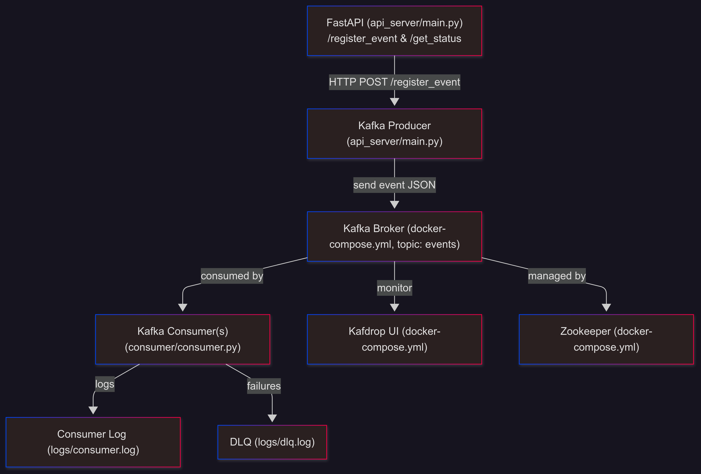
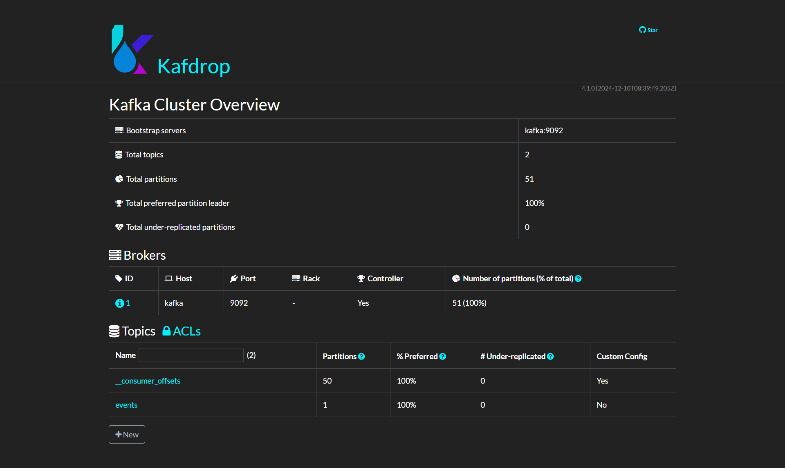
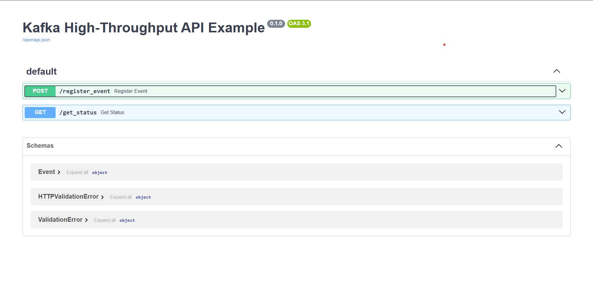
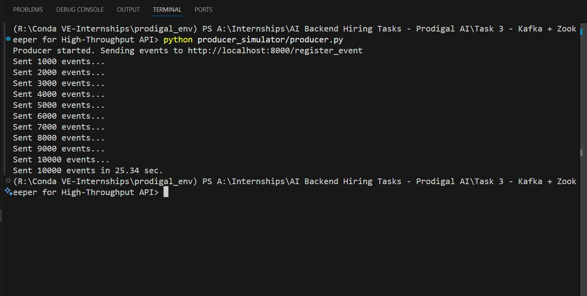
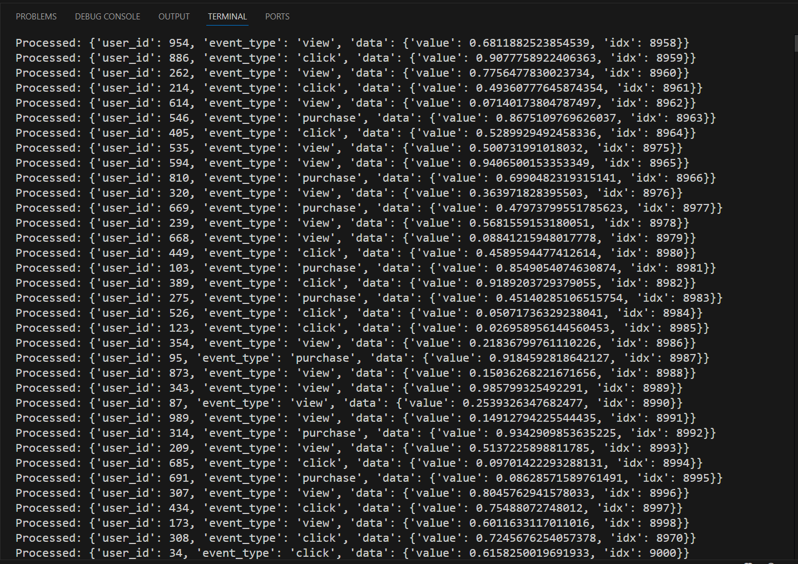

# 🚀 High-Throughput Event API with Kafka, Zookeeper, FastAPI & Docker

[](https://www.python.org/)
[](https://www.docker.com/)
[](https://fastapi.tiangolo.com/)
[](https://kafka.apache.org/)
[](https://github.com/apache/zookeeper)
[](https://github.com/obsidiandynamics/kafdrop)
[](../LICENSE)

<p align="center">
  <b>⚡️ Professional, High-Throughput Event Ingestion & Processing Pipeline with FastAPI, Kafka, Docker Compose, Kafdrop & Zookeeper ⚡️</b>
</p>

---

## 📽️ Demo Video

> [▶️ Watch Demo on Google Drive](https://drive.google.com/file/d/1ixwrW1pxjJ8gTwwPzmZTpNX7d0R9Gu5Z/view?usp=sharing)

---

## 📚 Table of Contents

1. [Project Overview](#project-overview)
2. [Kafka Architecture](#kafka-architecture)
3. [Prerequisites](#prerequisites)
    - [Python Installation](#python-installation)
      - [Windows](#windows)
      - [macOS](#macos)
      - [Linux (Ubuntu/Debian)](#linux-ubuntudebian)
      - [Linux (Fedora/CentOS)](#linux-fedoracentos)
    - [Docker & Docker Compose Installation](#docker--docker-compose-installation)
      - [Windows & macOS](#windows--macos)
      - [Linux (Ubuntu)](#linux-ubuntu)
      - [Linux (Fedora)](#linux-fedora)
      - [Verify Docker & Docker Compose](#verify-docker--docker-compose)
4. [Project Structure](#project-structure)
5. [Setup Instructions](#setup-instructions)
    - [1. Clone the Repository](#1-clone-the-repository)
    - [2. Create and Activate Python Virtual Environment](#2-create-and-activate-python-virtual-environment-)
    - [3. Install Python Dependencies](#3-install-python-dependencies-)
    - [4. Configure Environment Variables](#4-configure-environment-variables-)
    - [5. Start Kafka, Zookeeper, Kafdrop Services](#5-start-kafka-zookeeper-kafdrop-services-)
    - [6. Start FastAPI Server](#6-start-fastapi-server-)
    - [7. Run Producer & Consumer](#7-run-producer--consumer-)
6. [API Usage](#api-usage)
    - [Register an Event](#register-an-event)
    - [Get Status](#get-status)
    - [Swagger UI](#swagger-ui)
7. [Monitoring with Kafdrop](#monitoring-with-kafdrop)
8. [Stopping All Services](#stopping-all-services)
9. [Troubleshooting & Tips](#troubleshooting--tips)
    - [Common Errors and Solutions](#common-errors-and-solutions)
10. [Project Screenshots](#project-screenshots)
11. [Advanced Usage](#advanced-usage)
    - [Scaling Out Consumers](#scaling-out-consumers)
    - [Customizing Kafka Topic](#customizing-kafka-topic)
    - [Changing Number of Kafka Partitions](#changing-number-of-kafka-partitions)
12. [Developer Notes](#developer-notes)
13. [License](#license)
14. [Contact](#contact)
15. [Thank You!](#thank-you)

---

## 📘 Project Overview

> **A scalable, production-grade solution for high-throughput event ingestion and processing, leveraging FastAPI as the API gateway, Apache Kafka for event streaming, Zookeeper for orchestration, Kafdrop for monitoring, and Docker Compose for seamless deployment. Features robust producer/consumer logic, DLQ support, error handling, and comprehensive logging.**

---

## 🗺️ Kafka Architecture

<p align="center">
  
</p>
<p align="center">
  <sub>FastAPI → Kafka Producer → Kafka Topic → Scalable Consumers → DLQ & Logging | Visualization & Monitoring via Kafdrop</sub>
</p>

---

## 🧰 Prerequisites

Make sure you have the following installed:

- **🐍 Python 3.8+**
- **🐳 Docker & Docker Compose**
- **🧪 Git (to clone repo)**

<details>
  <summary><strong>💡 Python Installation Guide</strong></summary>

<details>
<summary>Windows</summary>

- Download Python from [python.org](https://www.python.org/downloads/windows/) and install (check "Add Python to PATH").
- Verify:
    ```sh
    python --version
    ```

</details>

<details>
<summary>macOS</summary>

- Via Homebrew:
    ```sh
    brew install python
    ```
- Or from [python.org](https://www.python.org/downloads/macos/)
- Verify:
    ```sh
    python3 --version
    ```
</details>

<details>
<summary>Linux (Ubuntu/Debian)</summary>

```sh
sudo apt update
sudo apt install python3 python3-pip python3-venv
python3 --version
```
</details>
</details>

<details>
  <summary><strong>🐳 Docker & Docker Compose</strong></summary>

- **Windows/Mac:** Install [Docker Desktop](https://www.docker.com/products/docker-desktop/).
- **Linux:**  
    ```sh
    sudo apt update
    sudo apt install docker.io docker-compose
    sudo systemctl enable --now docker
    ```
- **Verify installation:**
    ```sh
    docker --version
    docker-compose --version
    ```
</details>

---

## 🗂️ Project Structure

```plaintext
.
├── api_server/                # 🚦 FastAPI application
│   └── main.py
├── consumer/                  # 🦾 Kafka consumer logic
│   └── consumer.py
├── producer_simulator/        # ⚡ Event producer/simulator
│   └── producer.py
├── logs/                      # 📑 Logs & DLQ (auto-created)
│   ├── consumer.log
│   └── dlq.log
├── requirements.txt           # 🐍 Python dependencies
├── docker-compose.yml         # 🐳 Docker Compose spec
├── .env.local                 # ⚙️ Environment variables
├── README.md                  # 📘 This file
└── assets/                    # 🖼️ Images & screenshots
    ├── kafka-topology.png
    ├── kafdrop-ui.png
    ├── fastapi-swagger.png
    ├── producer-terminal.png
    └── consumer-terminal.png
```

---

## 🚦 Quick Start Guide

### 1️⃣ Clone the Repository

```sh
git clone https://github.com/Pavansai20054/AI-Backend-Hiring-Tasks-Prodigal-AI.git

cd "AI-Backend-Hiring-Tasks-Prodigal-AI/Task 3 - Kafka + Zookeeper for High-Throughput API"
```

---

### 2️⃣ Create & Activate Virtual Environment 🧪

**Why?**  
- ➡️ Isolation, reproducibility, and cleanliness for your Python dependencies!

**Name suggestion:** `kafkaflow_env`

**Windows:**
```sh
python -m venv kafkaflow_env
kafkaflow_env\Scripts\activate
```
or (PowerShell):
```sh
.\kafkaflow_env\Scripts\Activate.ps1
```

**macOS/Linux:**
```sh
python3 -m venv kafkaflow_env
source kafkaflow_env/bin/activate
```

---

### 3️⃣ Install Python Dependencies 📦

```sh
pip install --upgrade pip
pip install -r requirements.txt
```

---

### 4️⃣ Configure Environment Variables 🌱

Create `.env.local` in the project root with:

```env
KAFKA_BROKER=localhost:29092
KAFKA_TOPIC=events
KAFKA_CONSUMER_GROUP=consumer-group-1
CONSUMER_LOG_FILE=logs/consumer.log
DLQ_FILE=logs/dlq.log
```

---
>**NOTE:** Make sure you start your Docker Desktop before running this command


### 5️⃣ Start Kafka, Zookeeper, Kafdrop 🐘⚡

```sh
docker-compose up -d
```

- Zookeeper: **2181**
- Kafka: **9092 (internal), 29092 (external)**
- Kafdrop UI: **9000**

_Check running services:_
```sh
docker-compose ps
```
_Stop services:_
```sh
docker-compose down -v
```

---

### 6️⃣ Start FastAPI Server in new terminal🚦

```sh
uvicorn api_server.main:app --reload
```

- **Swagger UI:** [http://localhost:8000/docs](http://localhost:8000/docs)

---

### 7️⃣ Run Producer & Consumer ⚡🐍

**Start Consumer:**
```sh
python consumer/consumer.py
```
(Leave running. Multiple instances = more throughput.)

**Run Producer Simulator:**
```sh
python producer_simulator/producer.py
```
(Sends 10,000+ simulated events.)

---

## 🛡️ API Usage

### 🔸 Register an Event

**POST** `/register_event`

```sh
curl -X POST "http://localhost:8000/register_event" \
     -H "Content-Type: application/json" \
     -d '{"user_id": 123, "event_type": "click", "data": {"value": 1.0}}'
```

### 🔸 Get Status

**GET** `/get_status`

```sh
curl http://localhost:8000/get_status
```

### 🔸 Swagger UI

- Interactive docs: [http://localhost:8000/docs](http://localhost:8000/docs)

---

## 📊 Monitoring & Observability

- **Kafdrop:** [http://localhost:9000](http://localhost:9000)
- Inspect topics, partitions, payloads, consumer groups in real time!

---

## 🛑 Stopping All Services

- **FastAPI, Consumer, Producer:**  
  `Ctrl+C` in their respective terminals.
- **Docker stack:**  
  ```sh
  docker-compose down -v
  ```

---

## 🆘 Troubleshooting & Tips

<details>
<summary><strong>Common Issues & Solutions</strong></summary>

- **Kafka Connection Errors:**  
  _NoBrokersAvailable_  
  ➡️ Wait for Kafka to finish starting; check `docker-compose ps`.

- **.env.local Not Found:**  
  ➡️ Ensure `.env.local` exists in the root.

- **Permission Errors:**  
  ➡️ Use a venv; avoid sudo unless absolutely necessary.

- **Port Already In Use:**  
  ➡️ Kill previous process:  
  ```sh
  lsof -i :8000
  kill <PID>
  ```

- **Kafdrop Shows "No topics":**  
  ➡️ Send some events first, then refresh.

- **DLQ Not Populated:**  
  ➡️ Only failed events after all retries go to DLQ; if consumer succeeds, DLQ stays empty (normal).

- **PowerShell venv Activation Error:**  
  ➡️ As admin:  
  ```sh
  Set-ExecutionPolicy RemoteSigned
  ```

- **More...**  
  See full error explanations in the README under "Troubleshooting & Tips".

</details>

---

## 🖼️ Screenshots

<p align="center">
  
  <br/>
  <sub>High-level architecture diagram</sub>
</p>

<p align="center">
  
  <br/>
  <sub>Kafdrop: topic inspection & monitoring</sub>
</p>

<p align="center">
  
  <br/>
  <sub>Interactive API documentation</sub>
</p>

<p align="center">
  
  <br/>
  <sub>Producer terminal output</sub>
</p>

<p align="center">
  
  <br/>
  <sub>Consumer terminal output</sub>
</p>

---

## ⚙️ Advanced Usage

### 🧩 Scaling Out Consumers

- Run multiple `consumer.py` instances for parallel partition consumption.
- **Kafka will automatically rebalance partitions** for the given consumer group.

### 🛠️ Customizing Kafka Topics

- Change `KAFKA_TOPIC` in `.env.local`
- Use Kafdrop to monitor new topics and message flow.

### 🔁 Increasing Kafka Partitions

- Use Kafka CLI or configure producer/consumer to create topics with more partitions for even higher throughput.

---

## 🧑‍💻 Developer Notes

- **Logs:**  
  - `logs/consumer.log` — processed event logs  
  - `logs/dlq.log` — failed events
  - Directory auto-created if missing.

- **.gitkeep:**  
  - Add to `logs/` for git tracking when empty.

---

## ⚖️ License

**This project is NOT open source. All rights reserved.**

See [LICENSE](../LICENSE) for details.

- **No copying, use, distribution, or modification** without explicit written permission.
- Proprietary code, "All Rights Reserved".

---

## 👤 Contact

> **RANGDAL PAVANSAI**  
> 📧 pavansai87654321@gmail.com  
> 💻 [GitHub: Pavansai20054](https://github.com/Pavansai20054)

---

## 🎉 Thank You!

Thank you for exploring scalable, reliable event-driven architectures with this template!  
Feedback or suggestions? Contact via email or GitHub.

<p align="center">
  <b>Made with ❤️ by RANGDAL PAVANSAI</b>
</p>

---