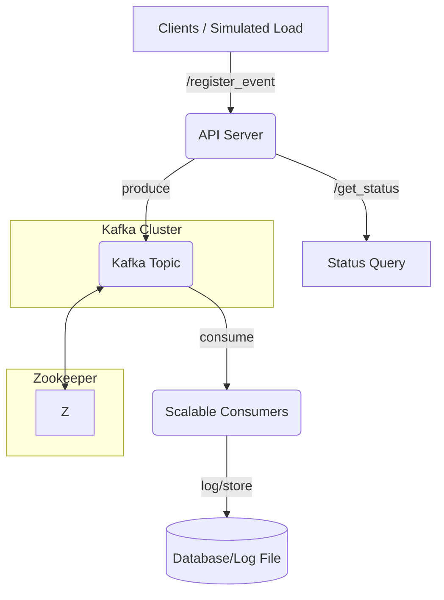

# ⚡ Kafka + Zookeeper for High-Throughput API Ingestion

---

## 🎯 **Objective**
**Simulate and showcase how Kafka enables reliable, high-throughput ingestion and processing of massive API requests.**

---

## 🛠️ **Setup Overview**

- 🐳 **Deploy Kafka + Zookeeper**  
  - Use **Docker Compose** for local, reproducible setup.

- 💥 **Simulate High Load**  
  - Generate **10,000+ requests/min** using Python or Node.js.

---

## 🔗 **System Architecture**

---

## 🚦 **Key Tasks**

### 1. **Kafka + Zookeeper Deployment**
- [ ] Provide **docker-compose.yml** with:
  - Kafka broker(s)
  - Zookeeper
  - (Optional) UI tools like **Kafdrop**

---

### 2. **API Development**
- [ ] **/register_event**  
  - Accepts event payload, produces to Kafka topic.
- [ ] **/get_status**  
  - Returns status (e.g., message offsets, processed count).

---

### 3. **Producer Simulation**
- [ ] **High-load generator** script  
  - Simulates 10,000+ requests/min.
  - Can be scaled via concurrency/async.

---

### 4. **Kafka Consumers**
- [ ] **Scalable consumer group**  
  - Consumes and processes events.
  - Logs/stores results (file, DB, or stdout).

---

### 5. **Reliability & Durability**
- [ ] **Demonstrate**:
  - Delivery guarantees (at-least-once, retry on failure)
  - Error handling (e.g., dead-letter queue)
  - Consumer logs with timestamps & error reporting

---

### 6. **(Bonus) Cloud Ingestion**
- [ ] **AWS Lambda + API Gateway**  
  - Accept events and forward to Kafka (or Kinesis).

---

## 📦 **Deliverables**

- [ ] **Kafka topology diagram**
- [ ] **docker-compose.yml** for local deployment
- [ ] **API code** (register_event, get_status)
- [ ] **Producer simulation script**
- [ ] **Consumer code** with logs & retry handling
- [ ] **Sample logs** demonstrating error handling/durability
- [ ] **README** with usage instructions

---

## 🌈 **Main Things To Do (Highlights)**

- **[ ] Set up Docker Compose for Kafka + Zookeeper**
- **[ ] Build & document /register_event and /get_status APIs**
- **[ ] Simulate massive API load (10,000+ requests/min)**
- **[ ] Implement Kafka producer and scalable consumers**
- **[ ] Ensure and document error handling, retries, and delivery guarantees**
- **[ ] Provide architecture diagram and sample logs**

---

## 🔥 **Tech Stack**

| Component        | Suggested Tech                |
|------------------|------------------------------|
| Message Broker   | **Kafka** (w/ Zookeeper)     |
| Containerization | **Docker Compose**           |
| API Server       | **FastAPI** / **Express.js** |
| Producer Script  | **Python** / **Node.js**     |
| Consumer         | **Python** / **Node.js**     |
| Monitoring       | **Kafdrop** / **Kafka UI**   |

---

> **Tip:**  
> Highlight error logs, retry scenarios, and throughput metrics in your demo!
>  
> Use colors, diagrams, and badges in your markdown for better clarity.

---