# 🚀 Kubernetes Pod Scaling with FastAPI & HPA

[](https://www.python.org/downloads/)
[](https://www.docker.com/) 
[](https://kubernetes.io/) 
[](https://fastapi.tiangolo.com/)
[](../../LICENSE)  

> 🎯 A comprehensive demonstration of Kubernetes Horizontal Pod Autoscaling (HPA) using FastAPI application with automated scaling based on CPU utilization.

---

## 📋 Table of Contents

- [🌟 Features](#-features)
- [🔧 Prerequisites](#-prerequisites)
- [⚙️ Installation](#️-installation)
  - [🐍 Python Installation](#-python-installation)
    - [🪟 Windows](#-windows)
    - [🍎 macOS](#-macos)
    - [🐧 Linux (Ubuntu/Debian)](#-linux-ubuntudebian)
    - [🐧 Linux (CentOS/RHEL/Fedora)](#-linux-centosrhelfedora)
  - [🐳 Docker Installation](#-docker-installation)
    - [🪟 Windows](#-windows-1)
    - [🍎 macOS](#-macos-1)
    - [🐧 Linux (Ubuntu/Debian)](#-linux-ubuntudebian-1)
    - [🐧 Linux (CentOS/RHEL/Fedora)](#-linux-centosrhelfedora-1)
  - [☸️ Minikube Installation](#️-minikube-installation)
    - [🪟 Windows](#-windows-2)
    - [🍎 macOS](#-macos-2)
    - [🐧 Linux](#-linux)
  - [🎛️ kubectl Installation](#️-kubectl-installation)
    - [🪟 Windows](#-windows-3)
    - [🍎 macOS](#-macos-3)
    - [🐧 Linux](#-linux-1)
  - [🔥 Load Testing Tool (Optional)](#-load-testing-tool-optional)
- [📁 Project Structure](#-project-structure)
- [🏗️ Architecture](#️-architecture)
- [🐳 FastAPI Application](#-fastapi-application)
  - [📍 Endpoints](#-endpoints)
  - [💻 Code Overview](#-code-overview)
- [📦 Dockerization](#-dockerization)
  - [🐳 Dockerfile](#-dockerfile)
  - [📄 requirements.txt](#-requirementstxt)
- [☸️ Kubernetes Manifests](#️-kubernetes-manifests)
  - [🚀 Deployment Configuration](#-deployment-configuration)
  - [🌐 Service Configuration](#-service-configuration)
  - [📊 HPA Configuration](#-hpa-configuration)
- [🚀 Quick Start](#-quick-start)
- [📈 Load Testing & Monitoring](#-load-testing--monitoring)
  - [🔍 Monitoring Commands](#-monitoring-commands)
  - [⚡ Load Testing Options](#-load-testing-options)
  - [📊 Expected Scaling Behavior](#-expected-scaling-behavior)
- [🔄 Autoscaling Commands](#-autoscaling-commands)
- [🔍 Troubleshooting](#-troubleshooting)
  - [🛑 Real-World Errors Faced and Solutions](#-real-world-errors-faced-and-solutions)
- [📚 References](#-references)
- [📝 License](#-license)
- [👤 Contact](#-contact)

---

## 🌟 Features

✅ **Horizontal Pod Autoscaling** - Automatic scaling based on CPU utilization  
✅ **FastAPI Integration** - High-performance Python web framework  
✅ **Docker Containerization** - Portable and consistent deployment  
✅ **Load Simulation** - Built-in CPU load generation endpoints  
✅ **Real-time Monitoring** - Live metrics and scaling observation  
✅ **Multi-OS Support** - Works on Windows, macOS, and Linux  
✅ **Production Ready** - Resource limits and requests configured  

---

## 🔧 Prerequisites

🐍 **Python 3.8+** - For FastAPI application development  
🐳 **Docker** - Container runtime and image building  
☸️ **Minikube** - Local Kubernetes cluster  
🎛️ **kubectl** - Kubernetes command-line tool  
📂 **Git** - Version control (for cloning repository)  

---

## ⚙️ Installation

> ⚠️ **Important for Windows Users**: When using Chocolatey commands, make sure to run PowerShell as Administrator. Right-click on PowerShell and select "Run as Administrator".

### 🐍 Python Installation

#### 🪟 Windows
```powershell
# Download from official website
# Visit: https://www.python.org/downloads/

# Or use Chocolatey (Run PowerShell as Administrator)
choco install python

# Verify installation
python --version
```

#### 🍎 macOS
```bash
# Using Homebrew
brew install python

# Or download from official website
# Visit: https://www.python.org/downloads/

# Verify installation
python3 --version
```

#### 🐧 Linux (Ubuntu/Debian)
```bash
sudo apt update
sudo apt install python3 python3-pip

# Verify installation
python3 --version
```

#### 🐧 Linux (CentOS/RHEL/Fedora)
```bash
# CentOS/RHEL
sudo yum install python3 python3-pip

# Fedora
sudo dnf install python3 python3-pip

# Verify installation
python3 --version
```

### 🐳 Docker Installation

#### 🪟 Windows
```powershell
# Download Docker Desktop from official website
# Visit: https://www.docker.com/products/docker-desktop/

# Or use Chocolatey (Run PowerShell as Administrator)
choco install docker-desktop

# Start Docker Desktop and verify
docker --version
```

#### 🍎 macOS
```bash
# Download Docker Desktop from official website
# Visit: https://www.docker.com/products/docker-desktop/

# Or use Homebrew
brew install --cask docker

# Verify installation
docker --version
```

#### 🐧 Linux (Ubuntu/Debian)
```bash
# Update package index
sudo apt update

# Install required packages
sudo apt install apt-transport-https ca-certificates curl gnupg lsb-release

# Add Docker's official GPG key
curl -fsSL https://download.docker.com/linux/ubuntu/gpg | sudo gpg --dearmor -o /usr/share/keyrings/docker-archive-keyring.gpg

# Add Docker repository
echo "deb [arch=amd64 signed-by=/usr/share/keyrings/docker-archive-keyring.gpg] https://download.docker.com/linux/ubuntu $(lsb_release -cs) stable" | sudo tee /etc/apt/sources.list.d/docker.list > /dev/null

# Install Docker
sudo apt update
sudo apt install docker-ce docker-ce-cli containerd.io

# Start and enable Docker
sudo systemctl start docker
sudo systemctl enable docker

# Add user to docker group (optional)
sudo usermod -aG docker $USER

# Verify installation
docker --version
```

#### 🐧 Linux (CentOS/RHEL/Fedora)
```bash
# CentOS/RHEL
sudo yum install -y yum-utils
sudo yum-config-manager --add-repo https://download.docker.com/linux/centos/docker-ce.repo
sudo yum install docker-ce docker-ce-cli containerd.io

# Fedora
sudo dnf -y install dnf-plugins-core
sudo dnf config-manager --add-repo https://download.docker.com/linux/fedora/docker-ce.repo
sudo dnf install docker-ce docker-ce-cli containerd.io

# Start and enable Docker
sudo systemctl start docker
sudo systemctl enable docker

# Verify installation
docker --version
```

### ☸️ Minikube Installation

#### 🪟 Windows
```powershell
# Using Chocolatey (Run PowerShell as Administrator)
choco install minikube

# Or download manually
# Visit: https://minikube.sigs.k8s.io/docs/start/

# Verify installation
minikube version
```

#### 🍎 macOS
```bash
# Using Homebrew
brew install minikube

# Or download manually
curl -LO https://storage.googleapis.com/minikube/releases/latest/minikube-darwin-amd64
sudo install minikube-darwin-amd64 /usr/local/bin/minikube

# Verify installation
minikube version
```

#### 🐧 Linux
```bash
# Download and install
curl -LO https://storage.googleapis.com/minikube/releases/latest/minikube-linux-amd64
sudo install minikube-linux-amd64 /usr/local/bin/minikube

# Verify installation
minikube version
```

### 🎛️ kubectl Installation

#### 🪟 Windows
```powershell
# Using Chocolatey (Run PowerShell as Administrator)
choco install kubernetes-cli

# Or download manually
curl -LO "https://dl.k8s.io/release/v1.28.0/bin/windows/amd64/kubectl.exe"
# Add to PATH

# Verify installation
kubectl version --client
```

#### 🍎 macOS
```bash
# Using Homebrew
brew install kubectl

# Or download manually
curl -LO "https://dl.k8s.io/release/$(curl -L -s https://dl.k8s.io/release/stable.txt)/bin/darwin/amd64/kubectl"
chmod +x ./kubectl
sudo mv ./kubectl /usr/local/bin/kubectl

# Verify installation
kubectl version --client
```

#### 🐧 Linux
```bash
# Download and install
curl -LO "https://dl.k8s.io/release/$(curl -L -s https://dl.k8s.io/release/stable.txt)/bin/linux/amd64/kubectl"
chmod +x kubectl
sudo mv kubectl /usr/local/bin/

# Verify installation
kubectl version --client
```

### 🔥 Load Testing Tool (Optional)

#### hey Installation

#### 🪟 Windows
```powershell
# Using Chocolatey (Run PowerShell as Administrator)
choco install hey

# Or download from GitHub releases
# Visit: https://github.com/rakyll/hey/releases
```

#### 🍎 macOS
```bash
# Using Homebrew
brew install hey
```

#### 🐧 Linux
```bash
# Download from GitHub releases
wget https://github.com/rakyll/hey/releases/latest/download/hey_linux_amd64
chmod +x hey_linux_amd64
sudo mv hey_linux_amd64 /usr/local/bin/hey
```

---

## 📁 Project Structure

```
k8s-hpa-demo/
│
├── 📂 app/
│   └── 🐍 main.py              # FastAPI application with load endpoints
│
├── 📂 k8s/
│   ├── 📄 deployment.yaml      # Kubernetes Deployment manifest
│   ├── 📄 service.yaml         # Kubernetes Service manifest
│   └── 📄 hpa.yaml             # Kubernetes HPA manifest
│
├── 🐳 Dockerfile               # Docker container configuration
├── 📄 requirements.txt         # Python dependencies
├── 🐍 load_test.py             # Python load testing script
├── 📖 README.md                # Project documentation
└── 📝 LICENSE                  # Apache 2.0 License
```

---

## 🏗️ Architecture

```mermaid
graph TB
    A[👤 User Traffic] --> B[🌐 Kubernetes Service]
    B --> C[📊 HPA Controller]
    C --> D[📈 Metrics Server]
    D --> E[📦 FastAPI Pods]
    C --> F{🔄 Scale Decision}
    F -->|High CPU| G[➕ Scale Up]
    F -->|Low CPU| H[➖ Scale Down]
    G --> E
    H --> E
```



---

## 🐳 FastAPI Application

The application provides two main endpoints:

### 📍 Endpoints

🟢 **`GET /`** - Health check endpoint  
🔥 **`GET /load?duration=10`** - CPU load simulation endpoint  

### 💻 Code Overview

```python
from fastapi import FastAPI
import time

app = FastAPI()

@app.get("/")
def read_root():
    return {"message": "Hello, Kubernetes HPA!"}

@app.get("/load")
def load_cpu(duration: int = 10):
    """
    Loads CPU for `duration` seconds. Default: 10 seconds.
    """
    end = time.time() + duration
    while time.time() < end:
        _ = 12345 * 67890  # Busy loop to load CPU
    return {"message": f"Loaded CPU for {duration} seconds"}
```

---

## 📦 Dockerization

### 🐳 Dockerfile

```dockerfile
FROM python:3.9-slim

# Set working directory
WORKDIR /app

# Copy requirements and install dependencies
COPY requirements.txt .
RUN pip install --no-cache-dir -r requirements.txt

# Copy application code
COPY app ./app

# Expose port
EXPOSE 8000

# Run application
CMD ["uvicorn", "app.main:app", "--host", "0.0.0.0", "--port", "8000"]
```

### 📄 requirements.txt

```txt
fastapi
uvicorn
```

---

## ☸️ Kubernetes Manifests

### 🚀 Deployment Configuration

```yaml
apiVersion: apps/v1
kind: Deployment
metadata:
  name: fastapi-hpa-demo
spec:
  replicas: 1
  selector:
    matchLabels:
      app: fastapi-hpa-demo
  template:
    metadata:
      labels:
        app: fastapi-hpa-demo
    spec:
      containers:
      - name: fastapi-hpa-demo
        image: fastapi-hpa-demo:latest
        imagePullPolicy: Never
        ports:
        - containerPort: 8000
        resources:
          requests:
            cpu: 100m
            memory: 128Mi
          limits:
            cpu: 500m
            memory: 256Mi
```

### 🌐 Service Configuration

```yaml
apiVersion: v1
kind: Service
metadata:
  name: fastapi-hpa-demo
spec:
  type: NodePort
  selector:
    app: fastapi-hpa-demo
  ports:
    - protocol: TCP
      port: 80
      targetPort: 8000
```

### 📊 HPA Configuration

```yaml
apiVersion: autoscaling/v2
kind: HorizontalPodAutoscaler
metadata:
  name: fastapi-hpa-demo-hpa
spec:
  scaleTargetRef:
    apiVersion: apps/v1
    kind: Deployment
    name: fastapi-hpa-demo
  minReplicas: 1
  maxReplicas: 10
  metrics:
    - type: Resource
      resource:
        name: cpu
        target:
          type: Utilization
          averageUtilization: 20
```

---

### 💡 Tip: Lowering CPU Utilization Threshold for Easier Demo

If you want to see scaling happen faster or under lighter load, **edit your HPA manifest** (`k8s/hpa.yaml`) and lower the `averageUtilization` value.  
For example, to trigger scaling more easily, set it to 10:

```yaml
  metrics:
    - type: Resource
      resource:
        name: cpu
        target:
          type: Utilization
          averageUtilization: 10
```

After making this change, update your HPA in the cluster with:

```bash
kubectl apply -f k8s/hpa.yaml
```

You can now generate load as before (see "Load Testing & Monitoring" section) and observe pods scaling up or down even with lighter traffic.

---

## 🚀 Quick Start

### 1️⃣ Clone Repository

```bash
git clone https://github.com/Pavansai20054/k8s-hpa-demo.git
cd k8s-hpa-demo
```

> ⚠️ Note: Before starting with step 2 make sure you turn on your docker desktop and it should be running. 

### 2️⃣ Start Minikube

```bash
minikube start --driver=docker --memory=4096 --cpus=2
```

### 3️⃣ Enable Metrics Server

```bash
minikube addons enable metrics-server
```

---

### 4️⃣ **Build Docker Image INSIDE Minikube's Docker Environment**

> ⚠️ **If you are using a local image with `imagePullPolicy: Never`, you MUST build the Docker image inside Minikube's Docker environment.**  
> Otherwise, Kubernetes will not be able to find your image.

#### **A. Point your shell to Minikube's Docker**

In **PowerShell**, run:

```powershell
& minikube -p minikube docker-env | Invoke-Expression
```

#### **B. Build your image in this (Minikube's) Docker**

```powershell
docker build -t fastapi-hpa-demo:latest .
```
_Do this in your project directory with your Dockerfile._

#### **C. Confirm the image is present in Minikube's Docker**

```powershell
docker images
```
_You should see `fastapi-hpa-demo   latest` in the list._

#### **D. Delete your old pod so the new image is used**

```powershell
kubectl delete pod -l app=fastapi-hpa-demo
```
_Kubernetes will spin up a new pod automatically._

---

### 5️⃣ **Check metrics-server status**

After enabling the metrics server, check that it is running properly before proceeding.

#### On **Windows** (PowerShell or CMD):

```powershell
kubectl get pods -n kube-system | findstr metrics-server
```

#### On **Linux/macOS**:

```bash
kubectl get pods -n kube-system | grep metrics-server
```

You should see output similar to:

```
metrics-server-xxxx   1/1     Running   0     Xs
```

If metrics-server is **not running** or is in a CrashLoop, please see the troubleshooting section at the end of this README.

---

### 6️⃣ Deploy to Kubernetes

```bash
kubectl apply -f k8s/deployment.yaml
kubectl apply -f k8s/service.yaml
kubectl apply -f k8s/hpa.yaml
```

### 7️⃣ Expose Service

#### ⚠️ Important Note About Port Numbers

When you run:

```bash
minikube service fastapi-hpa-demo --url
```
- **🪟 On Windows with Docker driver:**  
  - The URL (especially the port) changes every time you run the command or restart Minikube.
  - **You must leave the terminal open** where you run this command; closing it will stop the port forwarding.

#### 🟢 **Recommended: Use kubectl port-forward for Consistent Port**

To avoid issues with changing ports, you can forward the service to a consistent local port (e.g., 7000):

```bash
kubectl port-forward svc/fastapi-hpa-demo 7000:80
```
- Use `http://127.0.0.1:7000` as your service URL everywhere (e.g., in load test scripts).
- Remember to leave this port-forward terminal open while testing.

### 8️⃣ Verify Deployment

```bash
kubectl get pods
kubectl get hpa
kubectl get svc
```

---

### 9️⃣ **Stopping and Cleaning Up Minikube**

When you are done with your development or demo session, you can stop or delete your Minikube cluster to free up system resources or start fresh:

#### **Stop Minikube**

Stops the Minikube cluster, but keeps all data and configurations.
```bash
minikube stop
```
> Use this when you want to pause your work and resume later without losing your Kubernetes resources.

#### **Delete Minikube**

Completely removes the Minikube cluster and all its resources, data, and configurations.
```bash
minikube delete --all
```
> Use this for a clean slate, troubleshooting, or when you want to reclaim disk space.
---

## 📈 Load Testing & Monitoring

### 📢 **Important: Update Your Load Script URL!**

If using `kubectl port-forward svc/fastapi-hpa-demo 7000:80`, set this in your Python script:

```python
URL = "http://127.0.0.1:7000/load?duration=10"
```

### 🔍 Monitoring Commands

```bash
# Show real-time CPU/memory usage for each pod
kubectl top pods

# Watch pods scale up/down as load changes
kubectl get pods -w

# Show HPA status: current/target CPU, replicas
kubectl get hpa

# Optional: Launch Kubernetes dashboard
minikube dashboard
```

### ⚡ Load Testing Options

#### Option 1: Using hey tool

```bash
hey -z 60s -c 20 "http://127.0.0.1:7000/load?duration=10"
```
- Replace the URL/port with your actual Minikube service URL if different.

#### Option 2: Using Python script

```python
import requests
import threading

URL = "http://127.0.0.1:7000/load?duration=10"  # Use port 7000 with port-forward

def hit_load():
    for _ in range(10):
        try:
            requests.get(URL)
        except Exception as e:
            print(e)

threads = [threading.Thread(target=hit_load) for _ in range(20)]
for t in threads:
    t.start()
for t in threads:
    t.join()
```
- Save this as `load_test.py` and run with `python load_test.py`.

#### Option 3: Using Browser

- Open multiple tabs to `http://127.0.0.1:7000/load?duration=10`

### 📊 Expected Scaling Behavior

1. **🏁 Initial State**: 1 pod running (`kubectl get pods`)
2. **🔥 Load Applied**: CPU usage increases (`kubectl top pods`)
3. **⬆️ Scale Up**: HPA increases pod count (`kubectl get pods -w`)
4. **🔻 Load Removed**: CPU usage decreases
5. **⬇️ Scale Down**: Pods reduced back to 1

#### 👉 After lowering CPU utilization threshold

If you have set `averageUtilization` to 10 in your HPA manifest, apply it:

```bash
kubectl apply -f k8s/hpa.yaml
```

Then, run your load test (using hey or the Python script as above). Now, scaling up and down will happen with even lighter traffic.  
Watch the effect with:

```bash
kubectl get hpa -w
kubectl get pods -w
```

---

## 🔄 Autoscaling Commands

You can create, view, and manage Horizontal Pod Autoscalers (HPA) using `kubectl autoscale` and related commands. Here are the most commonly used commands for autoscaling:

### ➕ Create an HPA (if not using the manifest file):

```bash
kubectl autoscale deployment fastapi-hpa-demo --cpu-percent=50 --min=1 --max=10
```
- This tells Kubernetes to scale the `fastapi-hpa-demo` deployment between 1 and 10 pods, targeting 50% average CPU utilization.

### 👀 View all HPAs:

```bash
kubectl get hpa
```

### 🔍 Describe a specific HPA (see events, status, current/target usage, scaling reason):

```bash
kubectl describe hpa fastapi-hpa-demo-hpa
```

### ✏️ Edit an existing HPA (change thresholds, min/max pods):

```bash
kubectl edit hpa fastapi-hpa-demo-hpa
```

### 🗑️ Delete an HPA:

```bash
kubectl delete hpa fastapi-hpa-demo-hpa
```

### 📏 Manually scale deployment (overrides HPA):

```bash
kubectl scale deployment fastapi-hpa-demo --replicas=5
```
> ⚠️ Note: This disables HPA control until you delete the manual scaling or reset the HPA.

### 👁️ Watch scaling events live:

```bash
kubectl get pods -w
kubectl get hpa -w
```

---

## 🔍 Troubleshooting

### 🛑 Real-World Errors Faced and Solutions

This section documents actual errors encountered during development and their solutions.

---

#### 1. **🌐 Service Port Changes and Connection Refused**

**❌ Error:**
```
minikube service fastapi-hpa-demo --url
http://127.0.0.1:64782
❗  Because you are using a Docker driver on windows, the terminal needs to be open to run it.
```
- Each time you run the command, the port (e.g., 64782) may change.
- Closing the terminal running `minikube service ... --url` will break the connection.

**🐍 Python load script error:**
```
HTTPConnectionPool(host='127.0.0.1', port=64782): Max retries exceeded with url: /load?duration=10 (Caused by NewConnectionError('<urllib3.connection.HTTPConnection object at ...>: Failed to establish a new connection: [WinError 10061] No connection could be made because the target machine actively refused it'))
```

**✅ Solution:**
- Always use the **latest URL** shown by `minikube service ... --url`.
- **Keep the terminal open** running this command.
- **🟢 Recommended:** Use port-forwarding to a fixed port (e.g., 7000):

    ```bash
    kubectl port-forward svc/fastapi-hpa-demo 7000:80
    ```
    Update your script to use `http://127.0.0.1:7000`.

---

#### 2. **✅ Successful Load Test Output**

If everything is set up correctly, you should see:

```
{'message': 'Loaded CPU for 10 seconds'}
{'message': 'Loaded CPU for 10 seconds'}
...
```
This means the requests are reaching your FastAPI pod, and CPU load is being generated.

---

#### 3. **📊 HPA Scaling and Metrics Server Issues**

**HPA status and scaling output:**

```
kubectl get hpa -w
NAME                   REFERENCE                     TARGETS         MINPODS   MAXPODS   REPLICAS   AGE
fastapi-hpa-demo-hpa   Deployment/fastapi-hpa-demo   cpu: 147%/20%   1         10        8          20h
```

**kubectl describe hpa ... output:**
```
Metrics: ( current / target )
  resource cpu on pods  (as a percentage of request):  52% (52m) / 20%
...
Events:
  Warning  FailedComputeMetricsReplicas  ...  failed to get cpu utilization: unable to get metrics for resource cpu: no metrics returned from resource metrics API
  Normal   SuccessfulRescale             ...  New size: 8; reason: cpu resource utilization (percentage of request) above target
```

**💡 Explanation:**
- HPA is working: scaling up pods based on CPU load.
- Warnings about "failed to get metrics" are often due to metrics-server not being enabled or ready. If you see a `SuccessfulRescale` event, HPA is working correctly.

**✅ Solution:**
- Make sure metrics-server is enabled:
    ```bash
    minikube addons enable metrics-server
    ```
- Wait for metrics-server pod to be running:
    ```bash
    kubectl get pods -n kube-system | grep metrics-server
    ```
- If you see persistent metric fetch errors, restart metrics-server or minikube.

---

#### 4. **⚠️ AmbiguousSelector Warning (Multiple HPAs on Same Deployment)**

**❌ Error:**
```
Warning  AmbiguousSelector  ...  pods by selector app=fastapi-hpa-demo are controlled by multiple HPAs
```

**💡 Explanation:**
- You have more than one HPA object targeting the same deployment.

**✅ Solution:**
- Run `kubectl get hpa` and delete duplicate entries:
    ```bash
    kubectl delete hpa <extra-hpa-name>
    ```
- Only one HPA should control a deployment at a time.

---

#### 5. **🔧 General Debugging Tips**

- 🔍 Check pod status: `kubectl get pods -w`
- 📊 Check resource usage: `kubectl top pods`
- 📈 Check HPA status: `kubectl get hpa -w`
- 📝 View HPA events: `kubectl describe hpa fastapi-hpa-demo-hpa`
- 📋 View logs: `kubectl logs -l app=fastapi-hpa-demo`

---

## 📚 References

📖 [Kubernetes HPA Documentation](https://kubernetes.io/docs/tasks/run-application/horizontal-pod-autoscale/)  
📖 [FastAPI Documentation](https://fastapi.tiangolo.com/)  
📖 [Minikube Documentation](https://minikube.sigs.k8s.io/docs/)  
📖 [Docker Documentation](https://docs.docker.com/)  
📖 [kubectl Reference](https://kubernetes.io/docs/reference/kubectl/)  
📖 [Hey Load Testing Tool](https://github.com/rakyll/hey)  

---

## ⚖️ License

This project is **not open source**. All rights reserved.

See the [LICENSE](../../LICENSE) file for details.
---

## 👤 Contact

**Pavan Sai** 👨‍💻

📧 **Email**: [pavansai7654321@gmail.com](mailto:pavansai7654321@gmail.com)  
🐙 **GitHub**: [@Pavansai20054](https://github.com/Pavansai20054)  

---

<div align="center">

### 🌟 If you found this project helpful, please give it a star! ⭐

**Made with ❤️ by [Pavan Sai](https://github.com/Pavansai20054)**

</div>