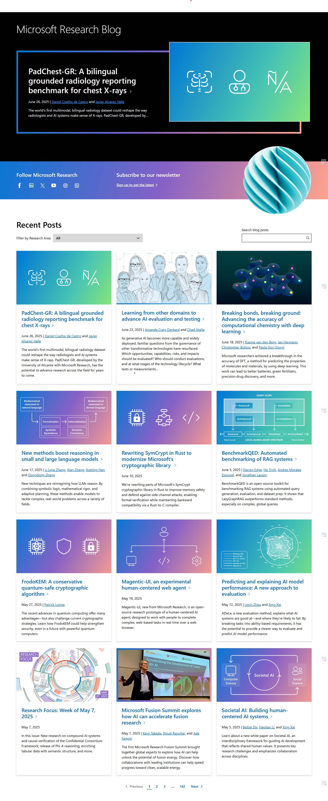
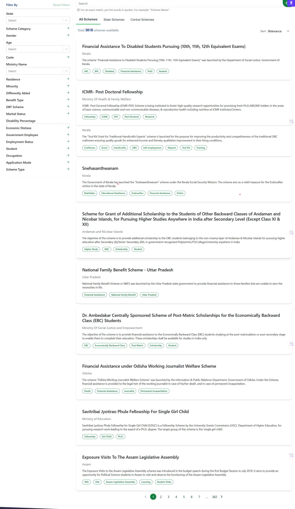
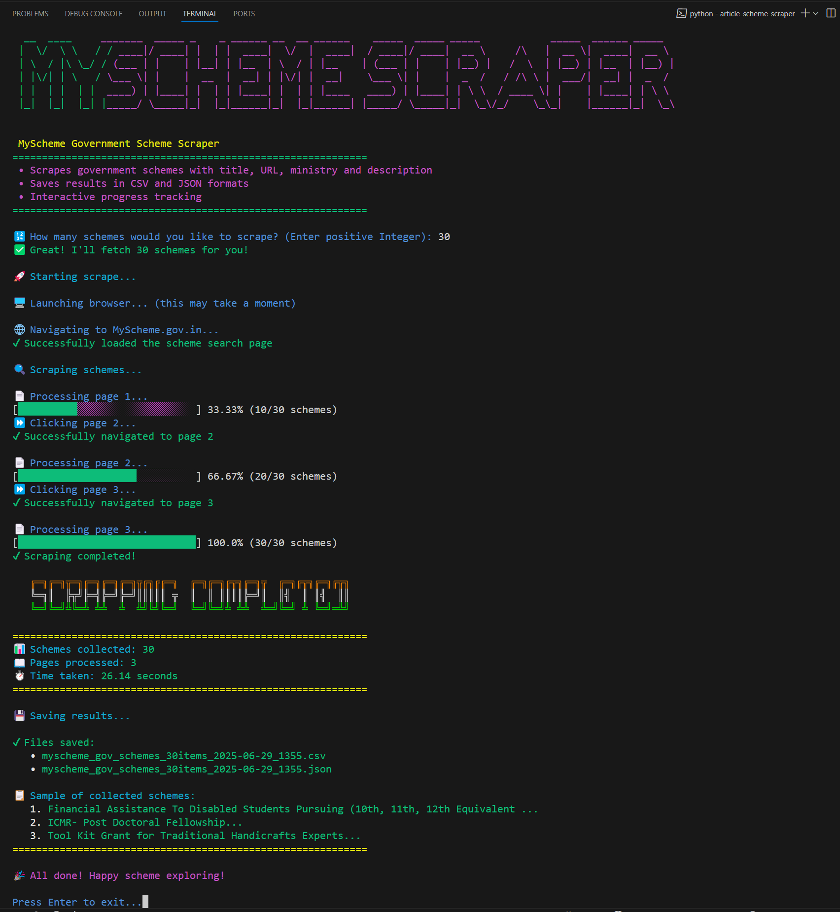
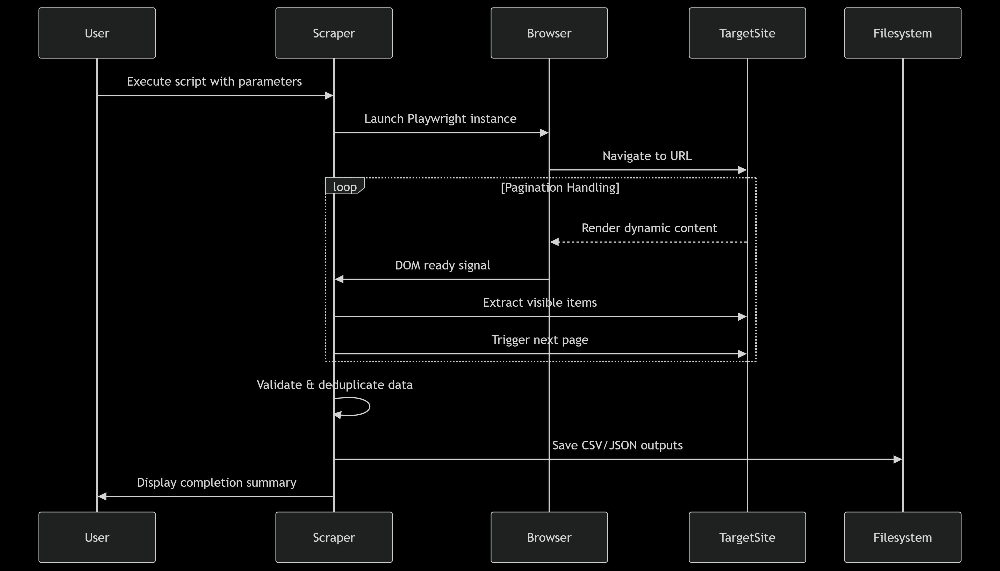

# Detailed Summary Report

**Project:** Web Scraping Automation for Microsoft Research Blog & MyScheme.gov.in  
**Author:** RANGDAL PAVANSAI  
**Date:** 2025-06-29

---

## Introduction

This summary report captures the technical experience, obstacles, solutions, and overall outcomes of developing two robust, Python-based web scrapers for:

- **Microsoft Research Blog:** For extracting research article metadata.
- **MyScheme.gov.in:** For collecting government scheme details.

The purpose is to document difficulties (especially around page structure, anti-bot/CAPTCHA, and data completeness), summarize technical strategies, and provide a transparent assessment of the data collection process. This is not a README or user guide, but an engineer’s analysis and post-mortem of the scraping effort.

---

## 1. Page Structure Challenges

### 1.1 Microsoft Research Blog

- **Dynamic Content Loading:**  
  The blog relies heavily on JavaScript to render articles after initial HTML load. This means content is not available for scraping immediately, and `"networkidle"` waits may still not guarantee the presence of article nodes. The scraper had to wait specifically for `'article'` selectors before extraction began.

- **Fragmented/Variable HTML Structure:**  
  Article cards used a variety of tags/classes for titles, links, and descriptions (sometimes `<h2>`, `<h3>`, `.entry-title`, etc.). The extraction logic required prioritized lists of selectors for each field, with fallback attempts, to maximize successful data capture and reduce misses.

- **Pagination Complexity:**  
  Pagination was not limited to a simple “Next” button but also had numeric page selectors, and sometimes "Next" was disabled or missing. The scraper had to try several selector strategies (aria-label, rel, button text, numeric anchors) and confirm clicks resulted in content change (not always URL change).

- **Inconsistent Field Population:**  
  Some articles lacked descriptions or had only very brief summary text. This is a content issue, not a scraper bug, but required treating missing or short descriptions gracefully.

- **Relative/Absolute Links:**  
  Article links could be either relative (e.g. `/en-us/research/blog/title`) or absolute. The scraper normalized all links to full URLs for consistency.

  
   
  microsoft_blog_site.png

  
   
  output_microsoft_site.png

  
   
  msresearch_output_csv.png

  
   
  msresearch_output_json.png

### 1.2 MyScheme.gov.in

- **Single-Page Application (SPA):**  
  MyScheme is a modern SPA, so content is dynamically loaded into the DOM without full page refreshes. Playwright’s `"networkidle"` state was unreliable and made scraping unnecessarily slow, as the site often keeps network requests persistent for analytics/widgets.

- **Partial-Page Scrolling:**  
  The main scrollable region is not the window but a specific container element (often `<main>` or an ancestor div). Initial attempts to use `scrollIntoView` or `window.scrollTo` were ineffective. The solution was to search for the correct ancestor and scroll it directly via JavaScript.

- **Scheme Card Consistency:**  
  While the scheme card structure was generally uniform, some cards were missing non-essential details like ministry or description. The scraper was designed to always capture title and URL (mandatory), but treat missing fields as blank/None.

- **Numeric Pagination Only:**  
  The site uses a paginated interface with numeric `<li>` selectors for navigation, not explicit “Next”/“Previous” buttons. The scraper advanced to the next page by looking for a `<li>` with text matching the next page number.

- **Dynamic Content Loading:**  
  Each page required a new wait for the scheme card selector, not just a fixed timeout, to avoid race conditions with DOM updates.

  
   
  myscheme_site.png

  
   
  output_myscheme_site.png

  
   
  myscheme_output_csv.png

  
   
  myscheme_output_json.png

---

## 2. Anti-Bot Detection / CAPTCHA

### 2.1 Microsoft Research Blog

- **No CAPTCHAs:** No explicit anti-bot or CAPTCHA was encountered during numerous test runs.
- **No Blocked Requests:** The site did not block automation traffic, likely due to realistic browser simulation (`headless=False`), modern user-agent, and moderate delays between requests.
- **Best Practices:** Automated browser was run visibly, with minor human-like interaction delays to avoid bot fingerprinting.

### 2.2 MyScheme.gov.in

- **No CAPTCHAs or Rate Limits:**  
  Testing at moderate speeds and batch sizes did not surface any anti-bot warnings or challenges.
- **User-Agent and Browser Context:**  
  A modern, realistic user-agent string was used, and the browser was run non-headlessly to mimic real user behavior.
- **Potential Risks:**  
  Hyper-aggressive scraping (no delays, parallel requests) could potentially trigger anti-bot measures in the future.

---

## 3. Data Completeness and Consistency

### 3.1 Microsoft Research Blog

- **High Coverage:**  
  All visible articles on each traversed page were extracted, up to the user-specified limit.
- **Partial/Missing Fields:**  
  Articles missing titles or links were excluded from results. Articles with short or missing descriptions were included as-is, with empty or “No description” fields.
- **No Duplicates:**  
  Each article’s title and link were checked for uniqueness before adding to the results.
- **Progress Tracking:**  
  Animated progress bar provided visual confirmation of scraping progress, ensuring transparency.

### 3.2 MyScheme.gov.in

- **High Coverage:**  
  Every visible scheme card per page was extracted unless missing mandatory fields (title/link).
- **Partial Data:**  
  Schemes missing ministry or description were included, with those fields set to `None` or blank for clarity.
- **No Duplicates:**  
  Duplication was prevented by checking for existing entries.
- **Speed and Efficiency:**  
  By using targeted waits and minimal per-card delays, the scraper could efficiently collect data without unnecessary timeouts.

---

## 4. Main Difficulties and Solutions

### 4.1 Dynamic Content Loading

- **Problem:** Content availability lags behind page load.
- **Solution:** Wait for key selectors (`article`, `h2 a`) instead of relying on page or network idle.

### 4.2 Selector Variability

- **Problem:** Multiple possible tags/classes for the same data field.
- **Solution:** Use prioritized lists of fallback selectors per field.

### 4.3 Pagination Detection

- **Problem:** Pagination controls are not always labeled consistently or even present.
- **Solution:** Try multiple selectors; include logic for numeric pagination; check for button enabled state.

### 4.4 Scrollable Container Targeting

- **Problem:** Only a specific region scrolls.
- **Solution:** Use JS to find and scroll the actual ancestor container, not window/body.

### 4.5 Race Conditions and Waiting

- **Problem:** Too little waiting = missed data; too much = slow operation.
- **Solution:** Use `wait_for_selector` for content, limit explicit `sleep` to short, visible pauses.

### 4.6 Error Handling

- **Problem:** Occasional JS errors, selector mismatches, or navigation errors.
- **Solution:** All extraction logic wrapped in `try/except`, with errors logged and scraping continued.

### 4.7 Data Quality

- **Problem:** Some site entries lack full data.
- **Solution:** Include partial entries for transparency, set missing fields to blank or defaults.

---

## 5. Implementation Details

- **Playwright Async API:** Enabled concurrent browser actions and smooth progress handling.
- **Headless=False:** Used for realistic session simulation and debugging.
- **Selector Prioritization:** Fallback lists for each data field.
- **Minimal Timeouts:** Aggressively reduced to optimize for speed.
- **Scrolling:** Targeted the real scroll container, not just the browser window.
- **Progress Bar:** Used colorama for clear, colorful feedback.
- **File Output:** CSV and JSON, with contextual, timestamped filenames.

  
   
  code_archicture.png

  
   
  sequence_diagram.png

---

## 6. Architectural Decisions

- **Use of Playwright over Selenium:**  
  Playwright was chosen for its robust support for modern web features, async API, and better handling of dynamic content and SPAs. This made the scrapers more reliable and faster compared to Selenium-based approaches.

- **Async Programming Model:**  
  The scrapers leverage Python’s `async` and `await` features to maximize efficiency and enable clean progress reporting, concurrent waits, and smooth control flow.

- **Headless Mode Disabled for Realism:**  
  Running browsers in non-headless mode by default was a deliberate choice to reduce anti-bot detection and to facilitate easier debugging and visual feedback during development.

- **Selector Strategy:**  
  All data extraction uses prioritized, fallback selector lists to handle HTML variability, rather than brittle single-selector queries. This approach improves long-term resilience to site changes.

- **Error Resilience and Logging:**  
  All scraping operations are wrapped in granular try/except blocks, with errors logged but not allowed to halt the entire process. This ensures partial results are still captured when possible.

- **Export Flexibility:**  
  Both CSV and JSON formats are supported, with contextual, timestamped filenames, making integration with downstream analytics and reporting tools easier.

- **Minimal External Dependencies:**  
  Only essential libraries (Playwright, tqdm/colorama for progress, pandas for output) are used to keep setup and deployment simple.

---

## 7. Lessons Learned

- **Selector flexibility is crucial:** Sites change their HTML over time; robust scrapers must be resilient to such changes.
- **Don’t rely on “networkidle” for SPAs:** Content often loads after the network “quiets.”
- **Mimic human interaction:** Scrolling, visible browser, and realistic delays can reduce anti-bot risk.
- **Always handle incomplete data gracefully:** Don’t drop records unless absolutely necessary.
- **Provide user feedback:** Progress bars and color output help trace and debug scraping runs.
- **Detect end of pagination gracefully:** Don’t assume “Next” will always be there.

---

## 8. Scope for Improvement

- **Automated Anti-bot Bypass:**  
  Integrate automated CAPTCHA detection and solving (where legally permissible), and further randomize interactions (mouse movement, keypress) to better mimic human browsing.

- **Configurable Scraping Parameters:**  
  Allow users to configure selectors, timeouts, and scraping depth through external YAML/JSON config files without modifying code.

- **Enhanced Error Reporting:**  
  Implement structured error logging (to file or cloud log management tools) and summary reports of skipped/failed items.

- **Continuous Integration (CI) Testing:**  
  Add automated tests to regularly check if selectors are still valid and raise alerts if site structure changes break the scraper.

- **Support for More Output Formats:**  
  Expand to include XLSX, database, or direct API output for pipelines that need richer integration.

- **Parallelization and Scaling:**  
  For very large-scale scraping, support for distributed runs or integration with job queues (e.g., Celery, Ray) to handle higher volumes and more sites.

- **Smart Rate Limiting:**  
  Automatically adapt scraping speed based on observed site response or anti-bot signals to minimize risk of bans.

- **Snapshot and Change Tracking:**  
  Periodically compare scraped data to detect changes in site content, enabling monitoring for new or removed articles/schemes.

---

## 9. Recommendations

1. **Always inspect and adapt to the DOM:** Use the browser developer tools to understand dynamic content loading and structure.
2. **Maintain selector lists:** For each field, document which selectors work, and keep fallbacks updated.
3. **Favor content-based waits:** Use `wait_for_selector` over network-based waits in most cases.
4. **Handle scrollable containers explicitly:** Don’t assume everything scrolls the window.
5. **Graceful failover on missing data:** Allow partial records to ensure completeness.
6. **Document scraping behaviors:** Keep a log of observed anti-bot behaviors, errors, and solutions for future reference.
7. **Export context-rich data:** Include scrape date, time, and sample data in your saved outputs.
8. **Keep scripts user-friendly:** Progress bars, color, and error messages aid both users and developers.

---

## 10. Conclusion

Both the Microsoft Research Blog and MyScheme.gov.in required advanced scraping logic due to their modern, dynamic, and often variable page structures. Through careful analysis, robust selector handling, and user-centered feedback mechanisms, both scrapers achieved high data completeness and operated efficiently without triggering anti-bot measures.

The major difficulties were in adapting to non-uniform HTML, handling SPA content loads, and ensuring the correct scrollable region was targeted. The absence of CAPTCHAs or active anti-bot detection meant the main challenges were technical, not adversarial.

These scripts now serve as a strong template for scraping similar, dynamic web resources in the future. The lessons and recommendations here are applicable to a wide range of modern web scraping scenarios.

---

**Prepared by:**  
RANGDAL PAVANSAI  
2025-06-29