# 🌐 Web3 Daily Newsletter Bot 🤖

[](https://www.python.org/)
[](LICENSE)
[](https://github.com/Pavansai20054/web3-newsletter-bot)
[](https://ollama.com/)
[](https://www.langchain.com/)
[](https://en.wikipedia.org/wiki/Web3)

> A sophisticated, production-ready automated newsletter system that **aggregates, summarizes, and delivers the latest Web3 news** from top sources directly to Telegram groups using AI-powered summarization and seamless automation.

---

## 🎥 Demo Video

Watch the demo showcasing the Web3 Daily Newsletter Bot in action:

> [Click here to view the demo video on Google Drive](https://drive.google.com/file/d/1pirDiw_R_fGNzfuRJoPMGQOMHXEQ-tef/view?usp=sharing)

---

## 📑 Table of Contents

- [🌐 Web3 Daily Newsletter Bot 🤖](#-web3-daily-newsletter-bot-)
- [🎥 Demo Video](#demo-video)
- [📑 Table of Contents](#-table-of-contents)
- [📦 Prerequisites](#-prerequisites)
  - [🖥️ System Requirements](#️-system-requirements)
  - [🛠️ Software Dependencies](#️-software-dependencies)
- [✨ Key Features](#-key-features)
  - [🌐 Multi-Source Aggregation](#-multi-source-aggregation)
  - [🧠 AI-Powered Intelligence](#-ai-powered-intelligence)
  - [📬 Automated Delivery](#-automated-delivery)
  - [🔧 Production Ready](#-production-ready)
- [🏗️ System Architecture](#️-system-architecture)
  - [🔄 Agent Workflow](#-agent-workflow)
- [🚀 Quick Start](#-quick-start)
  - [📝 Project Structure](#-project-structure)
- [⚙️ Installation Guide](#️-installation-guide)
  - [1️⃣ Clone Repository](#1️⃣-clone-repository)
  - [2️⃣ Setup Python Environment](#2️⃣-setup-python-environment)
  - [3️⃣ Install Dependencies](#3️⃣-install-dependencies)
  - [4️⃣ Install Ollama](#4️⃣-install-ollama)
  - [5️⃣ Download LLM Model](#5️⃣-download-llm-model)
- [🛠️ Configuration](#️-configuration)
  - [🔐 Environment Variables](#-environment-variables)
  - [🤖 Telegram Bot Setup](#-telegram-bot-setup)
  - [🦙 Ollama LLM Configuration](#-ollama-llm-configuration)
- [🚦 Usage Instructions](#-usage-instructions)
  - [🏃 Basic Usage](#-basic-usage)
  - [🎛️ Command Line Options](#-command-line-options)
  - [📋 Configuration Examples](#-configuration-examples)
- [📊 System Flow](#-system-flow)
  - [🔄 Daily Pipeline Process](#-daily-pipeline-process)
  - [📈 Data Processing Pipeline](#-data-processing-pipeline)
- [🎯 Example Output](#-example-output)
  - [📰 Sample Newsletter](#-sample-newsletter)
  - [🖥️ CLI Output Example](#-cli-output-example)
- [⏰ Scheduling & Automation](#-scheduling--automation)
  - [🐧 Linux (systemd)](#-linux-systemd)
  - [🪟 Windows (Task Scheduler)](#-windows-task-scheduler)
  - [🐳 Docker Deployment](#-docker-deployment)
- [🔧 Troubleshooting](#-troubleshooting)
  - [❌ Common Issues](#-common-issues)
    - [Ollama Connection Error](#ollama-connection-error)
    - [Telegram Bot Errors](#telegram-bot-errors)
    - [Memory Issues](#memory-issues)
    - [Network/Scraping Failures](#networkscraping-failures)
- [📜 License & Copyright](#-license--copyright)
- [📞 Contact Information](#-contact-information)
  - [👨‍💻 Maintainer](#-maintainer)
  - [🚀 Project Links](#-project-links)
  - [💬 Support](#-support)
- [⭐ Final Call to Action](#-final-call-to-action)

---

## 📦 Prerequisites

### 🖥️ **System Requirements**

- **Python 3.9+** with pip package manager
- **4GB+ RAM** (recommended for LLM processing)
- **Internet connection** for scraping and API calls
- **Telegram account** with bot creation permissions
- **Membership in the [LangChainNewsAgent Telegram Group](https://t.me/+yp2bJMRHMG1jY2Nl)** _(for support & updates)_

### 🛠️ **Software Dependencies**

- **Ollama**: Local LLM runtime
- **Git**: Version control (for cloning)
- **Virtual environment**: Python venv or conda

---

## ✨ Key Features

### 🌐 **Multi-Source Aggregation**

- **CoinDesk**: Leading cryptocurrency news and analysis
- **CoinTelegraph**: Breaking crypto news and market insights
- **Decrypt**: Web3 culture and technology coverage
- **Bankless**: DeFi and decentralized finance focus

### 🧠 **AI-Powered Intelligence**

- **LangChain Agents**: Sophisticated multi-agent architecture
- **Ollama Integration**: Local LLM processing for privacy
- **Smart Summarization**: Concise, readable news summaries
- **Content Deduplication**: Eliminates duplicate stories across sources

### 📬 **Automated Delivery**

- **Telegram Integration**: Direct delivery to groups/channels
- **Rich Formatting**: Markdown-formatted newsletters
- **Scheduling Support**: Daily automated delivery
- **Simulation Mode**: Test with historical data

### 🔧 **Production Ready**

- **Error Handling**: Comprehensive retry mechanisms
- **Vector Database**: ChromaDB for article storage
- **Modular Design**: Easy to extend and maintain
- **Monitoring**: Colorful CLI output with status tracking

---

## 🏗️ System Architecture

```mermaid
graph TB
    A[🕐 Scheduler] --> B[📰 News Scrapers]
    B --> C{📊 Scraping Results}
    C --> D[CoinDesk Scraper]
    C --> E[CoinTelegraph Scraper]
    C --> F[Decrypt Scraper]
    C --> G[Bankless Scraper]

    D --> H[🔍 Deduplication Engine]
    E --> H
    F --> H
    G --> H

    H --> I[🎯 Top N Selection]
    I --> J[🤖 LangChain Agent]
    J --> K[🦙 Ollama LLM]
    K --> L[📝 Article Summarizer]

    L --> M[📄 Newsletter Composer]
    M --> N[📱 Telegram Bot]
    N --> O[👥 Telegram Group]

    H --> P[(🗄️ ChromaDB)]
    P --> Q[🔍 Vector Search]

    style A fill:#ff9999
    style J fill:#99ccff
    style K fill:#99ff99
    style N fill:#ffcc99
    style O fill:#cc99ff
```



### 🔄 **Agent Workflow**

```mermaid
sequenceDiagram
    participant S as 🕐 Scheduler
    participant A as 🤖 NewsletterAgents
    participant D as 🔍 Deduplicator
    participant L as 🦙 Ollama LLM
    participant T as 📱 Telegram Bot
    participant U as 👥 Users

    S->>A: Trigger daily pipeline
    A->>A: Scrape all sources
    A->>D: Send raw articles
    D->>D: Remove duplicates
    D->>L: Forward unique articles
    L->>L: Generate summaries
    L->>A: Return summarized articles
    A->>T: Send formatted newsletter
    T->>U: Deliver to Telegram group

    Note over S,U: Complete automation from scraping to delivery
```



---

## 🚀 Quick Start

### 📝 Project Structure

```
Task 7 - Multi-Agent Newsletter Generator/
├── .env.local
├── agents.py
├── chroma_manager.py
├── config.py
├── cryptoplus_daily.bat
├── deduplicate.py
├── main.py
├── models.py
├── newsletter.py
├── README.md
├── requirements.txt
├── scheduler.py
├── summarizer.py
├── telegram_bot.py
├── todo.md
├── chroma_db/
├── markdown_files/
├── scraping/
│   ├── bankless.py
│   ├── coindesk.py
│   ├── cointelegraph.py
│   ├── decrypt.py
│   └── __init__.py
```

Get your Web3 newsletter bot running in **5 minutes**:

```bash
# Clone the repository
git clone https://github.com/Pavansai20054/AI-Backend-Hiring-Tasks-Prodigal-AI.git

cd "AI-Backend-Hiring-Tasks-Prodigal-AI/Task 7 - Multi-Agent Newsletter Generator"

# Setup virtual environment
python -m venv venv
source venv/bin/activate  # Linux/Mac
# venv\Scripts\activate   # Windows

# Install dependencies
pip install -r requirements.txt

# Configure environment (see Configuration section)
cp .env.example .env.local
# Edit .env.local with your tokens

# Install and setup Ollama
curl -fsSL https://ollama.com/install.sh | sh
ollama pull llama3:8b

# Run the bot
python main.py
```

---

## ⚙️ Installation Guide

### 1️⃣ **Clone Repository**

```bash
git clone https://github.com/Pavansai20054/web3-newsletter-bot.git
cd web3-newsletter-bot
```

### 2️⃣ **Setup Python Environment**

```bash
# Create virtual environment
python -m venv venv

# Activate environment
source venv/bin/activate        # Linux/Mac
# venv\Scripts\activate         # Windows

# Upgrade pip
pip install --upgrade pip
```

### 3️⃣ **Install Dependencies**

```bash
pip install -r requirements.txt
```

### 4️⃣ **Install Ollama**

```bash
# Linux/Mac
curl -fsSL https://ollama.com/install.sh | sh

# Windows: Download from https://ollama.com/download
```

### 5️⃣ **Download LLM Model**

```bash
# For high-performance systems
ollama pull llama3:8b

# For resource-constrained systems
ollama pull llama3:instruct
```
> If already pulled then serve it.

---

## 🛠️ Configuration

### 🔐 Environment Variables

Create `.env.local` file in project root:

```ini
# Telegram Configuration
TELEGRAM_BOT_TOKEN=your_bot_token_from_botfather
TELEGRAM_GROUP_ID=your_group_id_here

# Optional: Advanced Settings
TOP_N_ARTICLES=10
SIMULATION_DAYS=2
CHROMA_PERSIST_DIR=./chroma_db
```

### 🤖 Telegram Bot Setup

#### **Step 1: Create Bot**

1. Open [@BotFather](https://t.me/BotFather) on Telegram
2. Send `/newbot` command
3. Follow prompts to set bot name and username
4. Copy the API token to `.env.local`

#### **Step 2: Setup Group**

1. Create a new Telegram group
2. Add your bot to the group
3. Make bot an admin with "Post Messages" permission
4. Get group ID using [@RawDataBot](https://t.me/RawDataBot)

### 🦙 Ollama LLM Configuration

#### **Model Selection Guide**

```bash
# High-end systems (16GB+ RAM)
ollama pull llama3:70b          # Best quality
ollama pull mixtral:latest      # Alternative

# Mid-range systems (8GB RAM)
ollama pull llama3:8b           # Balanced

# Low-end systems (4GB RAM)
ollama pull llama3:instruct     # Optimized
ollama pull gemma:2b            # Lightweight
```

#### **Performance Optimization**

```bash
# Set environment variables
export OLLAMA_NUM_GPU=1           # Use GPU if available
export OLLAMA_MAX_KEEP_ALIVE=30m  # Keep model loaded
export OLLAMA_MAX_MEMORY=4096     # Memory limit in MB
```

---

## 🚦 Usage Instructions

### 🏃 **Basic Usage**

```bash
# Run with default settings
python main.py

# Run simulation mode (no Telegram sending)
python main.py --simulation-days 2

# Custom configuration
python main.py --top-n 15 --publications coindesk cointelegraph
```

### 🎛️ **Command Line Options**

| Option              | Description            | Default                                    |
| ------------------- | ---------------------- | ------------------------------------------ |
| `--publications`    | News sources to scrape | coindesk, cointelegraph, decrypt, bankless |
| `--top-n`           | Number of top articles | 10                                         |
| `--simulation-days` | Days to simulate       | 2                                          |

### 📋 **Configuration Examples**

```bash
# Focus on specific sources
python main.py --publications coindesk decrypt --top-n 5

# Extended simulation
python main.py --simulation-days 7 --top-n 8

# Quick test run
python main.py --simulation-days 1 --top-n 3
```

---

## 📊 System Flow

### 🔄 **Daily Pipeline Process**

```mermaid
flowchart TD
    A[🕐 Daily Trigger] --> B[📰 Scrape Sources]
    B --> C{🔍 Articles Found?}
    C -->|Yes| D[📊 Deduplicate]
    C -->|No| E[⚠️ Log Warning]
    E --> F[🔄 Retry Later]

    D --> G[🎯 Select Top N]
    G --> H[🤖 LangChain Agent]
    H --> I[🦙 Ollama Processing]
    I --> J[📝 Generate Summaries]
    J --> K[📄 Compose Newsletter]
    K --> L[📱 Send to Telegram]
    L --> M[✅ Success]

    style A fill:#e1f5fe
    style H fill:#f3e5f5
    style I fill:#e8f5e8
    style L fill:#fff3e0
    style M fill:#e4f5e4
```



### 📈 **Data Processing Pipeline**

1. **Scraping Phase**: Parallel fetching from all sources
2. **Deduplication**: Vector similarity using sentence-transformers
3. **Selection**: Ranking and top-N article selection
4. **Summarization**: LangChain + Ollama processing
5. **Composition**: Newsletter formatting with Markdown
6. **Delivery**: Telegram Bot API integration

---

## 🎯 Example Output

### 📰 **Sample Newsletter**

```markdown
📰 _Web3 Daily Newsletter_
_Date: 2025-01-08_
Top Stories from CoinDesk, CoinTelegraph, Decrypt, Bankless

_1. Bitcoin Surges Past $45K Amid Institutional Adoption_ [CoinDesk]
Bitcoin reaches new monthly high as major corporations continue adding crypto to their treasury reserves. The surge comes amid growing institutional interest and regulatory clarity in key markets.
[Read more](https://coindesk.com/bitcoin-surges-45k)

_2. Ethereum Layer 2 Solutions See Record Usage_ [CoinTelegraph]
Arbitrum and Optimism process over 1 million transactions daily as users migrate to cheaper alternatives. The shift indicates growing maturity of scaling solutions for the Ethereum ecosystem.
[Read more](https://cointelegraph.com/l2-record-usage)

_3. DeFi Protocol Launches Cross-Chain Bridge_ [Decrypt]
New interoperability solution connects Ethereum, Polygon, and Avalanche networks. The bridge aims to solve liquidity fragmentation across different blockchain ecosystems.
[Read more](https://decrypt.co/defi-cross-chain-bridge)

_Curated automatically by LangNewsAgent._
Feedback? Reply to this group or email feedback@example.com
To unsubscribe, remove yourself from this Telegram group.
```

### 🖥️ **CLI Output Example**

```bash
╒═══════════════════════════════════╕
│ WEB3 NEWSLETTER GENERATOR         │
╘═══════════════════════════════════╛

ℹ Initializing components...
ℹ Sources: coindesk, cointelegraph, decrypt, bankless
ℹ Top articles per day: 10

⚙ LLM Agent: Initializing Ollama...
✓ LLM Agent: Ready to generate summaries
⚙ Scraper Agent: Fetching articles...
✓ Scraper Agent: Found 47 articles
⚙ VectorDB Agent: Storing articles...
✓ VectorDB Agent: Articles stored
⚙ Summarizer Agent: Generating summaries...
✓ Summarizer Agent: Generated 10 summaries
⚙ Composer Agent: Formatting newsletter...
✓ Composer Agent: Newsletter composed
⚙ Telegram Agent: Sending newsletter...
✓ Telegram Agent: Newsletter sent

✓ All tasks completed successfully!
```

---

## ⏰ Scheduling & Automation

### 🐧 **Linux (systemd)**

Create service file:

```bash
sudo tee /etc/systemd/system/web3news.service > /dev/null <<EOF
[Unit]
Description=Web3 Newsletter Bot
After=network.target

[Service]
Type=simple
User=ubuntu
WorkingDirectory=/path/to/web3-newsletter-bot
ExecStart=/path/to/venv/bin/python main.py
Restart=always
RestartSec=300

[Install]
WantedBy=multi-user.target
EOF

# Enable and start service
sudo systemctl enable web3news
sudo systemctl start web3news
```

# 🏃‍♂️ Universal Batch File for Python venv & Conda Environments

This batch file will automatically detect and use either a Python **venv** or a **conda** environment to run your script.  
**You only need one `.bat` file for both!**

---

## 📄 Batch File Content

```batch
@echo off
REM === Automated Python Script Runner: venv or conda ===

REM ======== CONFIGURATION (EDIT THESE PATHS) ========

REM -- Path to venv (virtual environment) folder (if using venv)
set VENV_PATH=R:\Conda VE-Internships\prodigal_env\venv

REM -- Path to conda activate.bat (if using conda)
set CONDA_ACTIVATE=R:\Conda VE-Internships\prodigal_env\Scripts\activate.bat

REM -- Name of your conda environment
set CONDA_ENV_NAME=prodigal_env

REM -- Path to your Python script (edit this for your use case)
set SCRIPT_PATH=R:\Conda VE-Internships\prodigal_env\my_script.py

REM ======== DO NOT EDIT BELOW THIS LINE UNLESS NEEDED ========

REM -- Try venv first
if exist "%VENV_PATH%\Scripts\python.exe" (
    echo [INFO] Running with Python venv...
    "%VENV_PATH%\Scripts\python.exe" "%SCRIPT_PATH%"
    goto end
)

REM -- Try conda
if exist "%CONDA_ACTIVATE%" (
    echo [INFO] Running with conda environment...
    CALL "%CONDA_ACTIVATE%" %CONDA_ENV_NAME%
    python "%SCRIPT_PATH%"
    goto end
)

REM -- Neither found
echo [ERROR] No valid venv or conda environment detected! Check your paths.

:end
pause
```

---

## 📝 What to Change

| Variable         | Description                               | Example Value                                   |
| ---------------- | ----------------------------------------- | ----------------------------------------------- |
| `VENV_PATH`      | Path to user's virtual environment folder | `C:\Users\Alice\project\venv`                   |
| `CONDA_ACTIVATE` | Path to user's `activate.bat` for conda   | `C:\Users\Alice\anaconda3\Scripts\activate.bat` |
| `CONDA_ENV_NAME` | User's conda environment name             | `myenv`                                         |
| `SCRIPT_PATH`    | Path to Python script to run              | `C:\Users\Alice\project\main.py`                |

**How to update:**

1. Open the `.bat` file in a text editor.
2. Change the four variables at the top to fit your own paths and environment names.
3. Save and run the file (double-click or use Task Scheduler).

---

## ✅ Key Points

- Only one `.bat` file is needed for both venv and conda.
- The script tries venv first, then conda, then gives an error if neither found.
- **Always use absolute paths.**
- If the environment or script path changes, just update the variables at the top.

---

# 🪟 How to Add Your Batch File to Windows Task Scheduler

## 1. Open Task Scheduler

- Press `Win + S`, type **Task Scheduler**, and open it.

---

## 2. Create a Basic Task

- Click **Create Basic Task...**
- Give it a **Name** (e.g., `CryptoPulse Daily Newsletter`).
- Set your **Trigger** Daily for 2 days.

---

## 3. Set the Action

- **Action:** Start a program

**Program/script:**

```
R:\Conda VE-Internships\prodigal_env\cryptopulse_daily.bat
```

**Start in (optional):**

```
R:\Conda VE-Internships\prodigal_env
```

> ⚠️ **If you move your batch file or project to another location or system, just modify the above lines to match the new path!**

---

## 4. Finish Setup

- Click **Finish**.
- You can right-click the task and select **Run** to test it.

---

**Your scheduled task will now run your batch file automatically according to your chosen schedule!**

### 🐳 **Docker Deployment**

```dockerfile
FROM python:3.9-slim

WORKDIR /app
COPY requirements.txt .
RUN pip install -r requirements.txt

COPY . .

CMD ["python", "main.py"]
```

---

## 🔧 Troubleshooting

### ❌ **Common Issues**

#### **Ollama Connection Error**

```bash
# Check Ollama service
ollama serve

# Verify model is available
ollama list

# Test model
ollama run llama3:8b "Hello world"
```

#### **Telegram Bot Errors**

- ✅ Verify bot token is correct
- ✅ Check group ID format (negative number)
- ✅ Ensure bot has admin permissions
- ✅ Confirm bot can send messages

#### **Memory Issues**

```bash
# Monitor memory usage
htop

# Use lighter model
ollama pull gemma:2b

# Limit memory in .env.local
OLLAMA_MAX_MEMORY=2048
```

#### **Network/Scraping Failures**

```bash
# Test connectivity
curl -v https://cointelegraph.com/rss

# Check firewall settings
sudo ufw status

# Verify DNS resolution
nslookup cointelegraph.com
```

---

## 📜 License & Copyright

```
Copyright (c) 2025 RANGDAL PAVANSAI
All Rights Reserved.

This software is proprietary and confidential. No part of this software
may be reproduced, distributed, or transmitted in any form or by any means,
including photocopying, recording, or other electronic or mechanical methods,
without the prior written permission of the copyright owner.

Unauthorized copying, modification, distribution, or use of this software
is strictly prohibited and may result in severe civil and criminal penalties.
```

**⚠️ NOTICE**: This project is under proprietary license. Commercial use, redistribution, or modification without explicit permission is prohibited.

---

## 📞 Contact Information

### 👨‍💻 **Maintainer**

**PAVANSAI RANGDAL**  
🎓 Full Stack Developer & AI Engineer  
📧 **Email**: [pavansai87654321@gmail.com](mailto:pavansai87654321@gmail.com)  
🐙 **GitHub**: [https://github.com/Pavansai20054](https://github.com/Pavansai20054)  
🌐 **LinkedIn**: [Connect with me](https://linkedin.com/in/pavansai-rangdal)

### 🚀 **Project Links**

- **Repository**: [Web3 Newsletter Bot](https://github.com/Pavansai20054/web3-newsletter-bot)
- **Issues**: [Report bugs or request features](https://github.com/Pavansai20054/web3-newsletter-bot/issues)
- **Discussions**: [Join the conversation](https://github.com/Pavansai20054/web3-newsletter-bot/discussions)

### 💬 **Support**

For technical support, feature requests, or business inquiries:

- 📧 Email: pavansai87654321@gmail.com
- 🐛 Bug reports: Use GitHub Issues
- 💡 Feature requests: Use GitHub Discussions

---

## ⭐ Final Call to Action

> **🎯 Ready to automate your Web3 news?** Follow the Quick Start guide above and have your newsletter bot running in minutes!

**⭐ If this project helps you, consider giving it a star on GitHub!**
